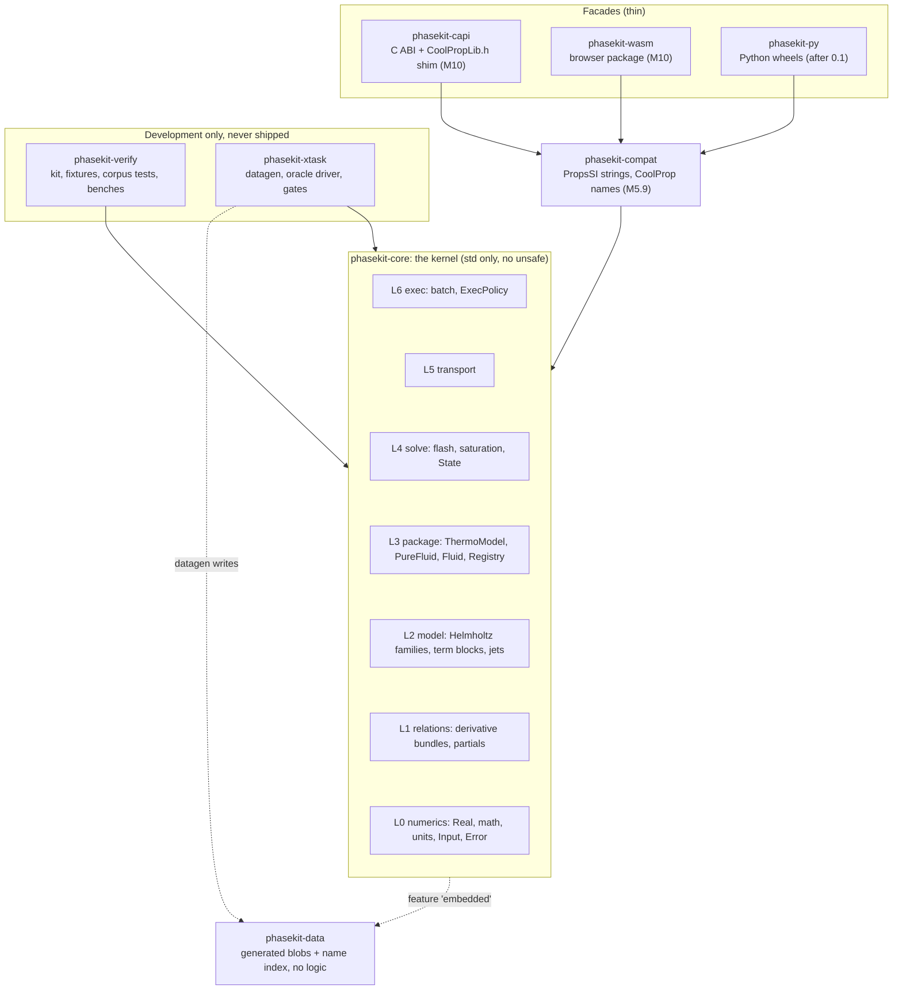
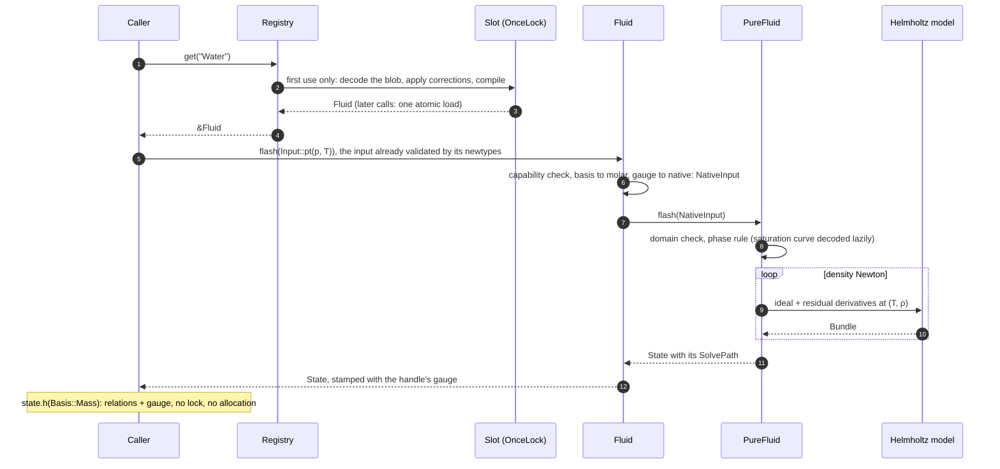
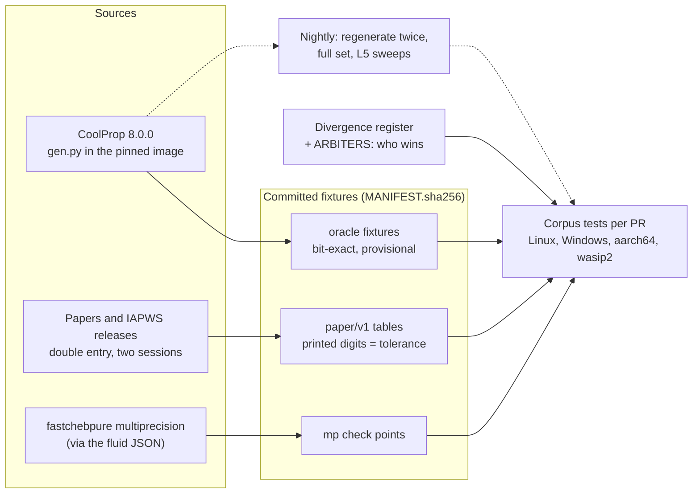

# phasekit architecture

**Status:** authoritative architecture for the TDD plan, revised 2026-10-05 after two adversarial critiques
([02-critique-simplicity.md](design/02-critique-simplicity.md), [02-critique-evidence.md](design/02-critique-evidence.md));
every issue's disposition is in [03-decision-log.md](design/03-decision-log.md). The user's answers to the open
questions ([04-user-decisions.md](design/04-user-decisions.md), first pass 2026-10-05) are integrated; §14 lists them.
Supersedes the four proposals.
**Name:** `phasekit` (D16, decided 2026-10-05): crates `phasekit-*`, Rust paths `phasekit_*`, C symbols `pk_*`.
**How it was decided:** four architects wrote competing proposals
([Lean](design/proposal-a-lean.md), [Extensible](design/proposal-b-extensible.md), [Kernel](design/proposal-c-kernel.md),
[Verification-first](design/proposal-d-verification-first.md)). Three independent judges scored them
([01-judgments.md](design/01-judgments.md); summary in [01-panel.md](design/01-panel.md)). Verification-first won
(7.55 against Lean 7.45). This document is that design, with the judges' fatal flaws fixed, the grafts that pay for
themselves applied, and the critics' fixes folded in. The compilable type sketch is [design/sketch](design/sketch):
5 crates (the M0 set plus `phasekit-compat`), std only, zero third-party dependencies, 47 passing tests (the doctest
executes). Every code excerpt below is copied from it with `///` doc comments trimmed.
**Companions:** [PLAN.md](PLAN.md) (milestones in detail), [VERIFICATION.md](VERIFICATION.md) (D13 in full),
[ROT-REGISTER.md](ROT-REGISTER.md) (the rot register; the divergence register is specified in VERIFICATION.md §6).
**Citations:** "map NN §X / R#" = `docs/coolprop-map/NN-*.md`; R#, K#, P#, T# and materials R#/S# = the recommendation
tables of `docs/research/{dependencies,kernel-performance,prior-art,materials-extensibility}.md`. Critic issue ids
(S-01…S-13, E1…E19) point to the decision log. "User decision N" is row N of
[04-user-decisions.md](design/04-user-decisions.md). Anything else is marked *(inference)*.

**Thesis.** The scalar `f64` path is the specification. Every layer exposes a typed seam where an independent check
attaches. CoolProp 8.0.0 is a provisional oracle; printed check tables arbitrate; every deliberate difference is a
typed, cited, proof-tested register entry. Two object-safe model traits make the library open: `HelmholtzModel` for
equation-of-state families, and `ThermoModel` for anything that can be flashed, which is what the registry, the batch
driver and every facade hold. Two plug-in traits (`SaturationCurve`, `DataSource`) and the sealed `Real` complete the
extension surface: five traits in all. Models are immutable and shared through `Arc`; a `State` is a 208-byte `Copy`
value. Concurrency then follows from the types, not from locks. Nothing ships in v0.1 without a caller.

## 1. Goals and non-goals

| User requirement (BRIEF §1, verbatim fragments) | Where the design satisfies it |
|---|---|
| "a plan to migrate coolprop to rust" | D15 milestones (§4); [PLAN.md](PLAN.md) |
| "modular extensible" ... "modularity is again KEY" | §2 crates, §3 two model traits, §11 seams; out-of-tree family, Gibbs-solid and two-phase tests |
| "memory safe" | `unsafe_code = "forbid"` everywhere except `phasekit-capi` (D17) |
| "cross platform" ... "windows, linux, and wasm" | 4 targets checked by the sketch; CI matrix D17; WASM loading §8; Rust on wasip2 supported, a WIT component on demand (D11) |
| "connected fluid properties library" (interpreted: embeddable in services, simulators, browsers) | Registries are values; Rust, C, WASM and Python facades (§12); a network server is an outer facade, never core |
| "rot in there we can eliminate" | §13, [ROT-REGISTER.md](ROT-REGISTER.md) |
| "DRY, SOLID code in idiomatic modern Rust" | One pair table, one input gate, one `Prop` table, one relations layer, one EOS encoder; small traits (ISP); families open/closed (OCP); edition 2024, newtypes, `Result` |
| "minimal dependencies so other projects can use this" | Core has zero third-party dependencies until M9 (optional `rayon`, `libm`). Later, only behind triggers: `fearless_simd` (`simd` feature, if the SIMD gate fires) and `serde_json` (`json` feature, when a runtime-JSON user exists) (D1, R1, R2) |
| "heavy OSS clear type constraints" | MIT OR Apache-2.0, cargo-deny, REUSE (D14); validating newtypes, typed errors, `#[non_exhaustive]`, sealed `Real` |
| "a kernal we can optimize for speed and scalability" | One kernel crate; scalar reference + side-by-side executors (§7); benches from M2, perf gates from M9 (§7) |
| "parallel requests on the same and different fluids ... at the same time" | Lock-free registry, `&Fluid` lookups, `Copy` `State` (§5, §6) |
| "Rusts immutability should help us here" | Models never mutate after construction; std's one-shot `OnceLock`/`LazyLock` are the only interior mutability (clippy bans `Mutex`, `RwLock`, `Cell`, `RefCell`, `OnceCell`); Send + Sync asserted at compile time |
| "using coolprop as varification but with source material when we find bugs" | Parity/Corrected datasets (Corrected by default), a 14-entry divergence register, three-part proofs (§10) |
| "We will TDD this step by step" | Capability set grows per milestone, so every milestone is green; no reachable panic (`todo`, `unimplemented`, `panic` denied) (D6, D12, D15) |
| "extend it to be a *material* properties library" / "all states of matter" | `ThermoModel`, `State::from_total` and `from_split`, Gibbs transform, `ThermoModel::derivs`, `Phase::Solid`, gauge on every handle (§11) |
| "coolprop fluids are first" | v0.1 = 136 pure and pseudo-pure HEOS fluids (bubble/dew typed), all 19 input pairs, transport (D15) |
| "only loading what is needed for the requests coming in" | Four lazy levels: index → EOS → saturation → transport and ECS references; browser packs added as registry layers (§6, §8) |
| "highfrequency and batch requests" | Zero-refcount lookups; allocation-free batch driver with per-cell status (§5) |
| "Layers will be important but we must not over engineer this" | 7 crates at v0.1, one kernel crate with module layers; SIMD, mixtures and materials are seams, not code; no hook without a caller (§2, §7, §11) |
| Follow-up: "parallel computation ... side by side implementations for different architectures ... SIMD" | "What" (model math over the sealed `Real`) vs "how" (`ExecPolicy`, `policy_equivalence`); SIMD lanes as a `simd` feature of core after a measured gate (§7) |

**Deferred, and why**
- Plotting, isolines and cycle helpers (CoolPropPlot): deferred until after the mixtures milestone (M13; user decision
  13). A presentation layer over saturation, `flash` and batch, never mapped (digest coverage note); a separate crate.
- TTSE/BICUBIC tables are not ported: crashes and silent garbage reproduced on the oracle (map 08 R1-R9). A future
  surrogate is a `ThermoModel` keyed by `ModelKey` and gated against the exact model (map 08).
- REFPROP backend: proprietary and process-global; it may serve only as an out-of-process second oracle (map 07).
- GPU (K16), WASM threads (K15), a `no_std` kernel (kernel-performance §5 Q6), non-SI units in the core, CoolProp
  defects reproduced for parity (map 01 Q3). Post-0.1 behind existing seams: SIMD, mixtures, cubic, PC-SAFT, IF97, ice,
  INCOMP, humid air, Python (own namespace plus a `compat` submodule; D11).

## 2. Layers and crates

```text
 facades (thin)   phasekit-capi (pk_* + shim, M10)  phasekit-wasm (browser, M10)  phasekit-py (after 0.1)
                            \                             |                            /
 migration                   +-------------- phasekit-compat --------------------------+  PropsSI strings, ANY Registry
                                                          |
 kernel  phasekit-core (std only, forbid(unsafe); private modules, dependencies point down, lib.rs re-exports the API)
   L6 exec       batch                 ExecPolicy {Reference, Parallel}, Status   <- every policy == Reference, bitwise
   L5 transport  transport             closed CoolProp forms, lazy, ECS           <- paper rows stage by stage
   L4 solve      flash saturation state  pure flash, SolvePath, SatPair           <- round trips, capability matrix
   L3 package    model fluid data registry  ThermoModel, PureFluid, Fluid, layers <- Parity vs Corrected, lazy counts
   L2 model      helmholtz             HelmholtzModel, SoA term blocks, jets      <- jets vs AD, FD, paper alpha tables
   L1 relations  relations derivs      Bundle, Jacobian partials, Gibbs transform <- identities on synthetic bundles
   L0 numerics   num units input prop error  sealed Real, math, newtypes, pairs   <- unit tests
                                                          |  optional `embedded`
 data    phasekit-data    generated blobs + name/alias/CAS index + declared references; one feature per fluid
 dev     phasekit-verify  kit (provenance, tolerances, register, conformance) + corpus tests/ + fixtures/ + benches/
         phasekit-xtask   datagen (the one serde mirror), oracle driver, CI gates (never shipped)
 later   phasekit-mix, -cubic, -pcsaft, -iapws (IF97 + ice), -incomp, -humidair
```

The same structure as a diagram (each kernel layer depends only on the layers below it; dotted lines are optional or
build-time links):



| Crate | Responsibility | Depends on | Features | no_std? |
|---|---|---|---|---|
| `phasekit-core` | The kernel, L0-L6: numerics, Helmholtz families, relations, packages, registry, flash, saturation, transport, batch | `phasekit-data` (optional) | `fluids-all` (default), `fluids-core`, `embedded`; `rayon`, `libm` (M9); triggered only: `simd`, `json` | No: needs `std::sync` (`OnceLock`, `LazyLock`, `Arc`) |
| `phasekit-data` | Generated per-fluid LE blobs, index with declared references, `DATASET` id, CoolProp MIT notice. No logic | none | `all` (default), `core`, `fluid-<name>` (generated; each enables its ECS reference fluids) | Yes (`#![no_std]`) |
| `phasekit-compat` | `props_si_in(&Registry, ..)`, CoolProp names and keys, `FillPolicy`, legacy policies | core | `fluids-all` (default), `fluids-core`, `embedded` (forwarded) | No |
| `phasekit-capi` (M10) | `extern "C"` facade: `pk_*` symbols, registry handles, string keys, status codes, thread-local error; the Tier A CoolPropLib.h shim (v8.0.0 codes, process-wide errstring; D11) | compat | forwards `fluids-*`; `coolproplib-shim` | No |
| `phasekit-wasm` (M10) | wasm-bindgen browser package, baseline and `+simd128` builds | compat (`default-features = false`, `fluids-core`) | none | No |
| `phasekit-py` (after 0.1) | pyo3 abi3 wheels: import name `phasekit`, plus `phasekit.compat` for migration (D11) | compat | forwards `fluids-*`; `numpy` | No |
| `phasekit-verify` | Verification kit + conformance corpus + fixtures + benches; reusable by any family crate | core[`fluids-all`] (dev: compat) | none | No |
| `phasekit-xtask` | `datagen`, `oracle`, `gates` | core, serde + serde_json (tools tier T4) | none | No |

Kernel modules are not crates: no second consumer exists, and splitting one call chain costs semver and compile time
for nothing (kernel-performance §3.1, P11). A future crate appears only when its trigger fires (§11). Two facades
(`phasekit-capi`, `phasekit-wasm`) and Python depend on `phasekit-compat`, so one string grammar serves all three (DRY).
- **Feature unification (E7).** Every internal workspace dependency has `default-features = false`; each consumer
  names its fluid set. Observed in the sketch: `cargo tree -p phasekit-compat --no-default-features --features
  fluids-core` enables `phasekit-data` `core` only (no `fluid-r143a`). CI gates `cargo tree -e features -p
  phasekit-wasm --target wasm32-unknown-unknown` and a `.wasm` size budget.
- **Crates arrive with their milestone (S-11).** M0 builds core, data, verify and xtask; compat joins for the M5 seam
  gates (the sketch already has it because its tests use it); capi and wasm at M10; py after 0.1.

## 3. Core abstractions

Excerpts are from the sketch with `///` doc comments trimmed. Every module is private; `lib.rs` re-exports 59 names
plus the `batch` module (5 items) and the `math` module (10 functions); verify and xtask reach the growing records
through one `#[doc(hidden)] pub mod internal`, semver-exempt by convention *(inference)* (S-03).

| Who | Concepts (re-exported names) |
|---|---|
| User | `Registry`; `Fluid` (+ `Gauge`, `ReferenceState`); `Input` (+ `Pair`, `Var`, `Basis`, 7 quantity newtypes); `FlashOptions` (+ `RootPolicy`, `DomainPolicy`); `State` (+ `Phase`, `SolvePath`, `Strategy`); `Prop` (+ `Partial`, `DerivVar`); `batch`; `Error` (+ `DomainError`, `LoadError`, `Roots`); loading (`DataSource`, `Pack`, `Blob`, `FluidId`, `DataSet`) |
| Family author | `ThermoModel` (+ `NativeInput`, `Capabilities`, `FluidInfo`, `Limits`, `CriticalPoint`, `CriticalOrigin`, `ModelKey`, `Source`, `DataTerms`); `HelmholtzModel` (+ `Derivs`, `Order`, `Virials`); `PureFluid` (+ `PureFluidBuilder`); `SaturationCurve` (+ `SatAccuracy`, `SatPair`, `SatSide`); `State::from_total` / `from_split` (+ `Bundle`, `GibbsDerivs`, `bundle_from_gibbs`); `PointDerivs`; `Real` + `math` |

Public generic types: only `Derivs<R = f64>`, over the sealed `Real`. A few arguments take `impl Trait` (the EOS and a
saturation curve in the builder; initialiser and `Derivs::from_fn` closures) and `loaded`/`aliases` return
`impl Iterator`; nothing else is generic.

### 3.1 Numbers and the derivative currency (D2)

```rust
pub trait Real:
    sealed::Sealed
    + Copy
    + Debug
    + Send
    + Sync
    + 'static
    + Add<Output = Self>
    + Sub<Output = Self>
    + Mul<Output = Self>
    + Div<Output = Self>
    + Neg<Output = Self>
    + Add<f64, Output = Self>
    + Mul<f64, Output = Self>
{
    fn from_f64(x: f64) -> Self;
    fn exp(self) -> Self;
    fn expm1(self) -> Self;
    fn ln(self) -> Self;
    fn ln_1p(self) -> Self;
    fn powi(self, n: i32) -> Self;
    fn powf(self, y: f64) -> Self;
    fn sqrt(self) -> Self;
    fn sinh(self) -> Self;
    fn cosh(self) -> Self;
    fn atan(self) -> Self;
    fn abs(self) -> Self;
}
```

Sealed, so methods (a lane `Mask`/`select`, if SIMD ever lands) can be added without a break (S-02, E16). Implemented
by `f64` now and the in-house bivariate `Jet4` at M3.

```rust
#[derive(Clone, Copy, Debug, PartialEq)]
pub struct Derivs<R = f64> {
    a: [R; SLOTS],
    order: Order,
}

    pub const IDEAL_DELTA: Derivs = {
        let mut a = [0.0; SLOTS];
        a[idx(0, 1)] = 1.0;
        a[idx(0, 2)] = -1.0;
        a[idx(0, 3)] = 2.0;
        a[idx(0, 4)] = -6.0;
        Derivs { a, order: Order::Four }
    };
```

`Derivs` holds `A_ij = τ^i δ^j ∂^(i+j)α/∂τ^i∂δ^j`, reducing-invariant, to order 4. `Bundle` is its order-2 slice
(`a00, a10, a01, a20, a11, a02`): what a `State` stores per phase point and what `relations` turns into p, h, s, u, cv,
cp, w and every first partial derivative. It is the family-neutral currency for states of matter. Beyond it:

```rust
pub struct PointDerivs {
    total: Derivs,
    parts: Option<(Derivs, Derivs)>,
}
```

`PointDerivs::split(ideal, residual)` (Helmholtz families) or `from_total(total)` (a Gibbs solid's own order-3
transform): order 3-4 and the ideal/residual split for Cp0, residual h/s/g, CoolProp's α-term outputs, second partial
derivatives and the fundamental derivative (E1). `Virials { b, c, db_dt, dc_dt }` are exact zero-density
coefficients (E4).

### 3.2 How derivatives are obtained: the power term, fully implemented

A separable term `n τ^t δ^d e^(−cδ^l)` has scaled derivatives `α · B^τ_i · B^δ_j`:
- `B^τ_i` are the falling factorials of `t`, precomputed at decode (`bt`).
- `B^δ_j` are exact polynomials in `x = cδ^l` whose integer coefficients depend only on `(d, l)`: complete Bell
  polynomials of the log-jet, turned into `δ^j g^(j)/g` by Stirling numbers of the first kind, computed once at decode
  by polynomial arithmetic (`bd`). Horner on them has no cancellation as δ → 0. The log-jet recurrence it replaces lost
  2.2e-5 relative at δ = 1e-12 for d = 1, l = 1 (E4); 135 of 136 default EOSs have such terms.
- δ^d and δ^l come from a per-state multiplication table, so the 57 MBWR d = 0 terms stay finite at δ = 0.

One `exp` per term, about 10 multiply-adds for the δ-factors, no hand-written derivative per term. The same generic
code runs on `f64` and `Jet4` (and on lanes, if the gate fires).

```rust
    fn term<R: Real, const ORD: usize>(&self, k: usize, v: &Vars<R>) -> (R, [R; 5]) {
        let x = v.delta_pow[usize::from(self.l[k])] * self.c[k]; // c δ^l (0 for polynomial terms)
        let phi = (v.ln_tau * self.t[k] - x).exp() * v.delta_pow[usize::from(self.d[k])] * self.n[k];
        let mut bd = [R::from_f64(1.0); 5];
        for (j, (b, poly)) in bd.iter_mut().zip(&self.bd[k]).enumerate().take(ORD + 1).skip(1) {
            // Horner on the degree-j polynomial: exact coefficients, no cancellation as x → 0.
            *b = poly[..j].iter().rev().fold(R::from_f64(poly[j]), |acc, &ck| acc * x + ck);
        }
        (phi, bd)
    }
    pub(crate) fn accumulate<R: Real, const ORD: usize>(&self, v: &Vars<R>, acc: &mut Derivs<R>) {
        for k in 0..self.n.len() {
            let (phi, bd) = self.term::<R, ORD>(k, v);
            acc.add_outer::<ORD>(phi, &self.bt[k], &bd);
        }
    }
```

Sketch tests:
- `power_term_matches_hand_derivation`: n = 0.5, t = 1.5, d = 2, l = 1 at τ = 2, δ = 0.5. α = 0.21444097124017672,
  B^τ = [1, 1.5, 0.75, −0.375, 0.5625] and B^δ = [1, 1.5, 0.25, −1.625, 2.0625]; all 15 A_ij agree to 1e-15.
- `delta_factors_are_cancellation_free_near_zero_density`: B^δ_2 for d = 1, l ∈ {1, 2} at δ = 1e-4, 1e-8, 1e-12
  within 1e-15 relative of the hand formula.
- `zero_density_series_is_exact` and `virials_are_exact_taylor_coefficients`: B, C, dB/dT, dC/dT against hand
  derivations, including an MBWR d = 0 pair.
- `delta_exp_delta_closed_form`, `jets_match_hyperdual_ad`, `generic_fast_path_is_bitwise_scalar`,
  `finite_at_zero_density`, `ideal_delta_gives_mechanical_derivatives`, `planck_einstein_matches_ad` (all four
  τ-orders of `n ln(1 − e^(−θτ))`, written with `expm1`). The AD oracle in the sketch is a test-only hyper-dual; the
  real crate uses `num-dual` as a dev-dependency (S-07).

### 3.3 The family seam: `HelmholtzModel` (D3)

```rust
pub trait HelmholtzModel: Send + Sync + fmt::Debug {
    fn gas_constant(&self) -> f64;

    fn residual(&self, t: f64, rho: f64, order: Order) -> Derivs;

    fn ideal(&self, t: f64, rho: f64, order: Order) -> Derivs;

    fn rho_max(&self, t: f64) -> f64;

    fn zero_density(&self, _t: f64) -> Option<Virials> {
        None
    }
}
```

`zero_density` returns exact virials from the δ → 0 Taylor coefficients of α^r; `None` means virial outputs are
refused, never approximated at a small δ (map 12 R8). The out-of-tree van der Waals test family implements it
(B = b − a/RT, C = b²) and checks it against a low-density state.

### 3.4 The package seam: `ThermoModel`, `PureFluid`, `Fluid` (D3, D10)

```rust
pub trait ThermoModel: Send + Sync + fmt::Debug {
    fn info(&self) -> &FluidInfo;

    fn capabilities(&self) -> Capabilities;

    fn flash(&self, input: NativeInput, opts: &FlashOptions) -> Result<State, Error>;

    fn critical_point(&self) -> Option<CriticalPoint> {
        None
    }

    fn helmholtz(&self) -> Option<&dyn HelmholtzModel> {
        None
    }

    fn derivs(&self, state: &State, order: Order) -> Option<PointDerivs> {
        let (t, rho) = state.single_t_rho()?;
        let h = self.helmholtz()?;
        Some(PointDerivs::split(h.ideal(t, rho, order), h.residual(t, rho, order)))
    }

    fn viscosity(&self, _state: &State) -> Result<f64, Error> {
        Err(Error::NoModel { prop: Prop::Viscosity })
    }

    fn conductivity(&self, _state: &State) -> Result<f64, Error> {
        Err(Error::NoModel { prop: Prop::Conductivity })
    }

    fn surface_tension(&self, _t: f64) -> Result<f64, Error> {
        Err(Error::NoModel { prop: Prop::SurfaceTension })
    }
}
```

```rust
pub struct PureFluid {
    info: FluidInfo,
    eos: Box<dyn HelmholtzModel>,
    limits: Limits,
    critical: Option<CriticalPoint>,
    saturation: Lazy<Option<Box<dyn SaturationCurve>>>,
    transport: Lazy<TransportSet>,
}
pub struct Fluid {
    model: Arc<dyn ThermoModel>,
    gauge: Gauge,
}
    fn native(&self, input: Input) -> Result<NativeInput, Error> {
        let pair = input.pair();
        if !self.model.capabilities().contains(pair) {
            return Err(Error::Unsupported { pair });
        }
        Ok(input.to_native(self.info().molar_mass(), self.gauge))
    }
    pub fn flash(&self, input: Input, opts: &FlashOptions) -> Result<State, Error> {
        Ok(self.model.flash(self.native(input)?, opts)?.with_gauge(self.gauge))
    }
```

`Lazy<T>` is std's `LazyLock<Result<T, LoadError>, Box<dyn FnOnce() -> Result<T, LoadError> + Send>>`, which drops its
initialiser (and the blob and reference handles it captured) after the first call (S-08).
`PureFluid::builder(info, eos, limits).critical(..).saturation(..).lazy_saturation(..).build()` assembles a package
around ANY `HelmholtzModel`; required parts are arguments, so `build` cannot fail (S-09). The decoder uses it, and so
does a third-party family. `Registry::with_model(Arc<dyn ThermoModel>)` makes it reachable by name from Rust, compat
strings, batch, C and WASM.

### 3.5 Inputs: one table, one gate (D5)

```rust
pub struct Input {
    pair: Pair,
    x: (f64, Basis),
    y: (f64, Basis),
}
pub struct NativeInput {
    pair: Pair,
    x: f64,
    y: f64,
}
pairs! {
    QT qt(q: Quality, t: Temperature);
    PQ pq(p: Pressure, q: Quality);
    QS qs(q: Quality, s: Entropy);
```

One 19-line `pairs!` table generates the `#[non_exhaustive] Pair` enum, `Pair::ALL: &'static [Pair]`, `Pair::vars`
(from each quantity type's `VAR`) and the typed constructors (`Input::dt(Density, Temperature)`). `Input::new(pair, x,
y, basis)` is the one raw gate for batch, string, C and JS callers. `Fluid` turns an `Input` into a `NativeInput`
(validated, molar, native gauge) exactly once per call; models never re-validate, convert or see a gauge. The six
19-arm tables, the private `Molar` trait, `InputKind` and the typed → raw → typed round trip are gone (S-04).
`Capabilities` is a private 64-wide bitset (E11).

### 3.6 State and the states-of-matter seam (D5, D10)

```rust
pub struct State {
    t: f64,
    p: f64,
    phase: Phase,
    body: Body,
    r: f64,
    molar_mass: f64,
    gauge: Gauge,
    path: SolvePath,
    key: ModelKey,
    extrapolated: bool,
}
    pub fn from_total(
        key: ModelKey,
        t: f64,
        rho: f64,
        r: f64,
        molar_mass: f64,
        phase: Phase,
        total: &Bundle,
    ) -> Result<State, Error> {
        Self::single(key, t, rho, r, molar_mass, phase, total, EXTERNAL)
    }
    pub fn from_split(liquid: State, vapour: State, q: Quality, t: f64, p: f64) -> Result<State, Error> {
        Self::split(liquid, vapour, q, t, p, EXTERNAL)
    }

pub fn bundle_from_gibbs(r: f64, t: f64, p: f64, g: &GibbsDerivs) -> Result<(f64, Bundle), Error> {
    if !(g.g_p > 0.0 && g.g_pp < 0.0) {
        return Err(DomainError::MechanicallyUnstable.into());
    }
    let v = g.g_p;
    let rt = r * t;
    let pv = p * v / rt;
    let b = Bundle {
        a00: (g.g - p * v) / rt,
        a10: (g.g - p * v - t * g.g_t) / rt,
        a01: pv,
        a20: t * (g.g_tt * g.g_pp - g.g_tp * g.g_tp) / (r * g.g_pp),
        a11: pv + v * g.g_tp / (r * g.g_pp),
        a02: -v * v / (g.g_pp * rt) - 2.0 * pv,
    };
    Ok((1.0 / v, b))
}
```

- `Body` is one phase point or two (`q`, liquid, vapour); every point carries its own T, ρ and bundle, because a
  pseudo-pure fluid's bubble and dew points differ (E3).
- `from_split` is public (E2): any family builds two coexisting phases (IF97 across the dome, a mixture split, ice +
  vapour). It refuses foreign or two-phase inputs, phases with different R or M, and non-finite T or p. The core flash
  uses the same path.
- `from_total` validation (S-10, E17): T, ρ, R, M finite and > 0; the first-order entries finite; no NaN. A divergent
  second-order entry (cv at the non-analytic critical point of Water or CO₂) is kept: p, h and s survive, and cv, cp,
  w and partial derivatives report `Undefined { prop, phase }`.
- Extrapolation flag (D6): `is_extrapolated()` is true only for a state evaluated outside the validated domain under
  `DomainPolicy::Extrapolate`. `mark_extrapolated()` lets a family's own flash set it; a split inherits it from either
  phase; batch reports it per cell as `Status::Extrapolated`, which is not a failure.

A Gibbs-explicit model outside the core (`phasekit-verify/tests/gibbs_seam.rs`; PT gives the solid, QT ice + vapour):

```rust
impl ThermoModel for ToyIce {
    fn info(&self) -> &FluidInfo {
        &self.info
    }
    fn capabilities(&self) -> Capabilities {
        Capabilities::none().with(Pair::PT).with(Pair::QT)
    }
    fn flash(&self, input: NativeInput, _opts: &FlashOptions) -> Result<State, Error> {
        match (input.pair(), input.values()) {
            (Pair::PT, (p, t)) => self.state(t, p, Phase::Solid, Self::solid(t, p)),
            (Pair::QT, (q, t)) => {
                let p = Self::sublimation_pressure(t);
                let ice = self.state(t, p, Phase::Solid, Self::solid(t, p))?;
                let vapour = self.state(t, p, Phase::Gas, Self::vapour(t, p))?;
                State::from_split(ice, vapour, Quality::new(q)?, t, p)
            }
            (pair, _) => Err(Error::Unsupported { pair }),
        }
    }
}
```

### 3.7 Outputs and derivatives (D5, E1)

`Prop` is the one `#[non_exhaustive]` output table (`Fluid::prop`). Besides the first-order keys it has `Z`,
`Cp0molar`/`Cp0mass` and `Partial(Partial)`, where `Partial { of, wrt, at }` ranges over CoolProp's 12 first-order
variables (`DerivVar`: T, P, D, H, S, U, G in both bases; map 01 §4a). First partials come from the stored order-2
bundle through the Jacobian ratio `[X_T Z_ρ − X_ρ Z_T] / [Y_T Z_ρ − Y_ρ Z_T]` (map 01 U8), so every family gets them
with no model call; tests check `(∂h/∂T)_p = cp`, `(∂s/∂T)_p = cp/T` and `(∂ρ/∂p)_T` on van der Waals and on the
Gibbs solid. Order ≥ 3 and the ideal/residual parts come from `ThermoModel::derivs`; Cp0 uses it today and reports
`NoModel` for a family without an ideal part.

| Milestone | Outputs added (additive `Prop` variants) | Gate |
|---|---|---|
| M5 | first partials, Z, Cp0, residual h/s/g, Bvirial/Cvirial and their T-derivatives | identities; analytic virials; oracle |
| M7 | Cv/Cp/w/τ/δ as derivative variables, second partials (order 3), fundamental derivative, κ, β | Thorade & Saadat identities; oracle |
| M10 | strict `d(X)/d(Y)\|Z` and `d(d(X)/d(Y)\|Z)/d(W)\|V` grammar in compat; the 8 α-term outputs | 85-output oracle gate (map 01 §4a) |

### 3.8 Registry, data sources, flash, batch, saturation

| Item (exact signatures from the sketch) | Role |
|---|---|
| `pub fn embedded() -> Result<&'static Registry, Error>` | Process-wide registry; builds the static index on first call, decodes nothing; fails only on an inconsistent generated index |
| `pub fn from_embedded(data_set: DataSet) -> Result<Registry, Error>` | Private registry, e.g. `DataSet::Parity` for fixtures |
| `pub fn with_source(&self, source: Box<dyn DataSource>, data_set: DataSet) -> Result<Registry, Error>` | NEW registry with one more data layer (a `Pack`, files, a test double); refuses collisions, missing references and cycles |
| `pub fn with_model(&self, model: Arc<dyn ThermoModel>) -> Result<Registry, Error>` | NEW registry with one more provided model |
| `pub fn with_reference(&self, name: &str, reference: ReferenceState) -> Result<Registry, Error>` | NEW registry in which that fluid (all its aliases) reports in a reference state (E10) |
| `pub fn get(&self, name: &str) -> Result<&Fluid, Error>` | Name, alias or CAS, ASCII case-insensitive; returns a reference |
| `pub fn canonical_name(&self, name: &str) -> Option<&str>` / `preload` / `loaded` / `empty` | Resolution without loading; warm-up; memory introspection |

```rust
pub trait DataSource: Send + Sync + fmt::Debug {
    fn names(&self) -> Vec<Vec<String>>;
    fn blob(&self, id: FluidId) -> Result<Blob, LoadError>;
    fn references(&self, _id: FluidId) -> Vec<String> {
        Vec::new()
    }
}
```

`Pack::new(Arc<[u8]>) -> Result<Pack, LoadError>` implements `DataSource` (M2 format); JS calls it as
`registry.withPack(bytes)`. The decoded record (`FluidRecord`, `EosRecord`, `Patch`, `Edit`) is the arbitration seam,
reached through `phasekit_core::internal`.

```rust
pub(crate) fn flash(fluid: &PureFluid, input: NativeInput, opts: &FlashOptions) -> Result<State, Error> {
    let (x, y) = input.values();
    match input.pair() {
        Pair::DT => dt(fluid, y, x, opts),
        pair => Err(Error::Unsupported { pair }),
    }
}
```

`FlashOptions` (by value, private fields, `const` builders): `with_phase(Phase)` (per call, never sticky; a
single-phase label skips the phase rule, `TwoPhase` requires the dome), `with_roots(RootPolicy::{Strict, Nearest(x),
Stable})`, `with_domain(DomainPolicy::{Enforce, Extrapolate})`, `with_guess(t, rho)` (opt-in warm start). `Enforce`,
the default, refuses states below the triple point; `Extrapolate` evaluates metastable single-phase states and flags
them (D6).

```rust
pub struct SatPair {
    pub bubble: SatSide,
    pub dew: SatSide,
}
pub trait SaturationCurve: Send + Sync + fmt::Debug {
    fn accuracy(&self) -> SatAccuracy;
    fn t_range(&self) -> (f64, f64);
    fn at_t(&self, t: f64) -> Result<SatPair, Error>;
    fn at_p(&self, p: f64) -> Result<SatPair, Error>;
}
```

`SatSide { t, p, rho }`. A pure fluid's sides share T and p (`SatPair::is_pure`). A fresh or exactly rescaled
superancillary is `Exact`; ancillaries and a stale superancillary are `Guess` and get a VLE polish (M6); pseudo-pure
bubble/dew curves are `Definition` (E3). `t_range` is the fitted range: the flash never evaluates a curve outside it,
under any `DomainPolicy` (D6).

```rust
pub enum ExecPolicy {
    #[default]
    Reference,
    Parallel {
        chunk: NonZeroUsize,
    },
}
pub fn evaluate(
    fluid: &Fluid,
    req: &BatchRequest<'_>,
    out: &mut [f64],
    status: &mut [Status],
) -> Result<BatchSummary, Error> {
```

`BatchRequest::new(pair, basis, x, y, outputs)` with `with_flash` and `with_exec` (private fields). Every point goes
through `Input::new` and `Fluid::flash`, so batch and scalar are one code path; `Status` is one byte per cell
(`Extrapolated` marks a value computed outside the domain). Buffers are point-major everywhere: `out[i*M + k]` in Rust,
C and NumPy `(N, M)`; a future SIMD path transposes chunks internally (user decision 11).

```rust
const _: () = {
    const fn shared<T: ?Sized + Send + Sync + 'static>() {}
    shared::<Registry>();
    shared::<Fluid>();
    shared::<PureFluid>();
    shared::<helmholtz::MultiParameterEos>();
    shared::<dyn ThermoModel>();
    shared::<dyn HelmholtzModel>();
    shared::<dyn SaturationCurve>();
    shared::<dyn DataSource>();
    shared::<State>();
    shared::<FlashOptions>();
    shared::<Error>();
    assert!(core::mem::size_of::<State>() <= 256);
    assert!(core::mem::size_of::<Error>() <= 48);
};
```

## 4. Decisions D1-D17

Format: decision; *why*; *rejected*; evidence. Fatal flaws, grafts and critic fixes are named where they changed the
winner.

**D1 Workspace, crates, features.** The crates of §2: seven by v0.1 (core, data, compat, capi, wasm, verify, xtask),
`phasekit-py` after it; each arrives with its milestone. Features only add capability; none changes numerics (K13).
Internal dependencies default to no features, and facades forward `fluids-all`/`fluids-core` (E7). Core has no `json`
feature until a runtime-JSON consumer is scheduled; the one serde mirror lives in xtask (S-12).
*Why:* boundaries sit where dependency tier, release cadence or licence differ: a std-only core (R1); data with its own
version and CoolProp notice (map 09 §9); legacy policies outside the kernel (map 14 §9); bindings never leaking into
the core (dependencies T2); `phasekit-verify` depends on core, never the reverse. *Rejected:* a crate per layer, or
Kernel's 10 crates with a `phasekit` composition root (no second consumer; P11, kernel-performance §3.1); a
`phasekit-simd` crate (without that root it either cannot be reached by core or cannot implement core's `Real`; S-02);
data inside core (no runtime-loading split, mixed licence, WASM size); a crate per family before the family exists
(Extensible); `compat` inside core (Lean; map 14); empty facade crates from M0 (S-11).

**D2 Numeric core and derivatives.** The public API is `f64` SI. Model math is written once over the sealed public
`Real` (`f64` now, the in-house bivariate `Jet4` at M3, lanes only if the SIMD gate fires). It is public because
families outside the core write formulas over it and evaluate them on `Jet4`; it is sealed so methods can be added.
Separable term kinds use the precomputed-factor fast path (`accumulate::<R, const ORD>`): τ-side falling factorials and
δ-side exact polynomials in `x = cδ^l` (E4). Non-separable terms and new families use `Jet4`. Bundles go to order 4
behind an `Order` mask, so second partial derivatives, the fundamental derivative and critical points are open to every
family (Extensible's order-2 fatal flaw avoided). Virials come from `HelmholtzModel::zero_density`, exact.
*Why:*
- CoolProp hand-codes 20 outputs per term plus a test-only multicomplex copy, with wrong high orders (map 12 R5,
  map 10 R7).
- Generic differentiation reproduced CoolProp's hand-coded values to ≤ 3.4e-13 (map 02, method note).
- One exp per term is the cost centre (kernel-performance §2.4).
- δ^d comes from the table because 57 MBWR terms have d = 0 (map 02 §3). Checked in the v8.0.0 data: power d ≤ 15,
  l ≤ 6. A_ij stay finite at δ = 0 (kernel-performance §4).
- CoolProp's virials evaluate at δ = 1e-12 and its C virial is off by up to 7.1e-5 (map 12 §6.3).
*Rejected:* AD on the hot path (cost, kernel-performance §2.4); `num-dual` in core (orphan rule against lanes, churn;
R5, prior-art §2.2; it is the dev-dependency AD oracle); a second production AD type (`HyperDual`, S-07; the sketch
keeps a test-only stand-in because it has no dev-dependencies); the paper formula `value::<R>` as production code
(test oracle only); an unsealed `Real` or lane `Mask`/`select` before lanes exist (S-02); `std::autodiff` (nightly,
R4); porting CoolProp's `all()` (rot R5 itself).

**D3 Model representation.** Inside the multiparameter family, the set is closed: term kinds are an enum of SoA
blocks, `match`ed once per block; unknown kinds are a `LoadError`. Across families it is open through two object-safe
model traits:
- `HelmholtzModel` (4 required methods, 1 defaulted) is the EOS seam, in (T, ρ), returning reducing-invariant bundles.
- `ThermoModel` (3 required, 6 defaulted) is the package seam, held by the registry, batch, compat, C and WASM.

Two plug-in traits (`SaturationCurve`, `DataSource`) and the sealed `Real` make five traits in all. `PureFluid` is the
core's Helmholtz package around any `HelmholtzModel`; `Fluid` = `Arc<dyn ThermoModel>` + `Gauge`. A new family is a
new crate with zero core edits, proved by `tests/new_family.rs` and gated at M11 (cubic) by a zero-line diff in
`phasekit-core` (Extensible graft).
*Why:*
- Six separable kinds cover 99.8 % of default terms (map 02). CoolProp skips unknown blocks (map 10 R8, map 09 R7) and
  needed 4 core edits per transport form (map 12 R13).
- The (T, ρ) contract means no family invents a reducing state (map 06 C10, D4) and no τ/δ crosses a model boundary
  (map 06 C1).
- Dispatch happens once per evaluation, with a ≤ 2 % target measured from M3 *(inference)*.
*Rejected:*
- Verification-first's concrete `Registry` over `Arc<FluidData>` (fatal flaw).
- Kernel's `alphar(tau, delta)` + `reducing()` (thermo fatal flaw).
- Extensible's `Transport` and `Catalog` traits and `FamilyId` tokens (concept count; the registry layers and the
  closed transport enums do their jobs).
- A trait object per term; a closed family enum; a generic `Fluid<M>`.

**D4 Pure vs mixture.** Composition is not in the core contract. It is fixed inside a model instance (one `Arc` per
trimmed composition), so pure fluids pay nothing.
- `phasekit-mix` brings `Mixture: HelmholtzModel` at fixed z, reusing single-phase flashes, relations and `State`. Its
  own `ThermoModel` package does VLE and stability and returns two-phase splits through `State::from_split` (each
  phase point carries its own T and ρ; q is molar). A `MixtureModel` trait there gives composition derivatives by one
  mole-number AD path.
- `HelmholtzModel::ideal` is per model, so Lean's `IdealGas::weighted` core edit is unnecessary.
- A mixture handle's gauge is the mole-fraction-weighted component gauge. It is exact because composition is fixed,
  unlike Extensible's per-call `Gauge::mix`.
- Pseudo-pure fluids (Air, R404A, R407C, R410A, R507A, SES36) are `PureFluid`s with a `Definition` curve whose
  `SatPair` has distinct bubble and dew sides (E3). Decided (user decision 4): CoolProp's ancillary-defined rules,
  specified from oracle fixtures at M6 (QT only at Q ∈ {0, 1}; PQ gives T = Q·T_dew + (1 − Q)·T_bubble; the in-dome
  DT rule; map 04 §1). At M13 a true-mixture model (e.g. `R410A.mix`) is registered alongside; the pseudo-pure names
  keep their behaviour.

*Why:* about 100 pure/mixture branch sites and 6 fluid copies per pure state (map 04); zero fractions must be trimmed
(map 04, c7d6a1aa); composition is not always mole fractions (materials §4). *Verification:* x = [1, 0] equals the pure
fluid under any gauge (map 04, map 15 §8); GERG vectors from teqp (map 06, P10). *Rejected:* `&Composition` on every
call (Extensible); composition in `Input` or `State`; a separate `MixtureState` that `flash` cannot return (E2).

**D5 State and properties.**
- `State` is `Copy`, 208 B (asserted ≤ 256): T, p, phase, one or two phase points (each T, ρ and the order-2 total
  `Bundle`), R, M, gauge, `SolvePath`, `ModelKey` and an extrapolation flag (D6); fields are private.
- The bundle is eager; first-order properties and first partial derivatives are relations on demand (every family).
  Order ≥ 3 and the ideal/residual split come from `ThermoModel::derivs`; virials from `HelmholtzModel::zero_density`
  (E1, E4). The model refuses foreign states by `ModelKey` (Kernel graft).
- Inputs: `Input` (pair + two values with their bases) from typed constructors generated by one pair table, or from
  `Input::new`, the single raw gate. `Fluid` builds a `NativeInput` once (S-04).
- Outputs: typed getters (`h(Basis)`, `cp(Basis) -> Result`, `partial(Partial)`) plus one `Prop` table; additions are
  scheduled in §3.7.
- At a non-analytic critical point, p, h and s survive and cv, cp, w report `Undefined` (E17).
- Units: own `#[repr(transparent)]` SI newtypes (R11).

*Why:* map 01 U1-U8 and R2-R5; K1 (no `Arc` in `State`); kernel-performance §5 Q7 (eager order 2). *Rejected:*
`OnceCell` caches (they end `Copy`); public newtype fields (Lean); `uom` in core; a 19-variant input enum beside a raw
form (S-04).

**D6 Flash.** `ThermoModel::flash` is pure; the core Helmholtz flash is the crate-private `flash::flash(&PureFluid,
NativeInput, ..)`.
- Each pair runs a fixed ordered list of `Result` strategies; the winner goes to `State::path()`.
- Solvers return `Root{x, f(x), iterations, stop}` with typed `Tol`; exhaustion is an error.
- Phase rule, defined once (map 01 R26): hint → model critical point → `SaturationCurve` (`Exact` and `Definition`
  used, `Guess` polished by VLE) → generic pure VLE. Below Tc with no usable curve the answer is `Unsupported` until
  M6 brings VLE, never a load error or a guess (S-10). An imposed `TwoPhase` is honoured: outside the dome its lever
  rule gives q ∉ [0, 1], which is refused.
- Domain (user decision 6). `DomainPolicy::Enforce`, the default, refuses T below the triple point (the bound is the
  higher of `t_min` and `t_triple`, which CoolProp conflates; map 09 R8), above `Tmax` or `pmax`, and below the melting
  line. `Extrapolate`, opted into per call, evaluates the EOS for metastable single-phase states (supercooled water)
  and flags the `State` (`is_extrapolated`). Saturation fits (superancillary, ancillary) are never evaluated outside
  their fitted range under any policy; there the phase comes from a single-phase hint or the generic VLE (M6).
  CoolProp extrapolates its superancillary below the triple point and labels such DT states two-phase (map 03 §6).
- Superancillary evaluation (Clenshaw only) lands at M5 with DT, so the M5 DT gate covers subcritical states (E18).
- Density brackets come from `rho_max(T)` and saturation. The density Newton uses `residual + IDEAL_DELTA` and never
  evaluates α⁰ (Lean graft).
- `RootPolicy::Strict` returns `Ambiguous{roots}`.
- Acceptance gate: inputs reproduced, in domain, dp/dρ > 0 and cv > 0 unless a phase is imposed.
- Undeclared pairs return `Unsupported`; the core's declared set grows M5 → M7.

*Why:* map 03 §6 (sticky phase, solver/state mismatch, unchecked `max_iter`, a 6.1 % error from an absolute tolerance,
silent two-phase T+H, superancillary domain not enforced); map 12 R3/R4. *Rejected:* mutable state with `update()`;
exception cascades; a `Strategy` trait registry (YAGNI); a global `DONT_CHECK_PROPERTY_LIMITS`; fits extrapolated
below the triple point; silent fallbacks and NaN bundles (S-10).

**D7 Data pipeline.** `xtask datagen` turns the pinned v8.0.0 JSON into LE blobs plus a committed index that declares
each fluid's references. At run time: `DataSource → Blob → FluidRecord::decode → apply(DataSet) → builder →
PureFluid`. A registry layer resolves every declared reference to a strong slot handle and refuses missing or cyclic
references when it is built (E5); each fluid decodes on first use; saturation and transport materialise lazily (Kernel
graft). Corrections ship inside the data (rust-judge note); `DataSet::Corrected` applies them and is the default
(user decision 2), while `Parity` stays for oracle comparison. The hash gate covers the canonical bytes of the whole EOS
section: R or ρ_r corrections rescale the superancillary exactly; any other change demotes it to `Guess` (E14). §8 has
the details.
*Why:* 2.81 MiB raw, compression gains only 13-19 % (map 09); CoolProp's eager load costs about 1.9 s and +67 MiB
(map 14); ECS references built by name at first evaluation (map 05 R7). *Rejected:* runtime JSON by default (and its
feature, until scheduled; S-12); CBOR or `bincode` (R7); `build.rs` codegen (R6); compression (R8); Lean's eager ECS
decode (systems fatal flaw on Lean); late resolution by name through a `Weak` resolver (S-05, E5).

**D8 Concurrency kernel.**
- Registry: an immutable stack of layers (data sources and provided models). Each data-backed fluid is an `Arc<Slot>`
  with one `OnceLock<Result<Fluid, LoadError>>`; a failed decode is cached (no retry storms), a miss is not (E6).
- `Registry::get` returns `&Fluid`, with no refcount traffic (Kernel graft, without `FluidRef<'r>` lifetimes).
  `Fluid::clone` is one `Arc` increment; a `Fluid` is self-contained and outlives its registry (S-05).
- `State` holds no `Arc`. clippy bans locks, cells and env reads. Send + Sync + 'static is asserted at compile time.
- Batches use caller-owned buffers; `rayon` is optional with fixed chunks; warm starts are opt-in.

*Why:* K1-K7; map 11 F7-F11; map 10 §7. *Rejected:* `RwLock<HashMap>`; `thread_local!` scratch; per-thread copies;
`Weak` back-references to the registry (S-05).

**D9 Execution strategies.** "What" is model math generic over the sealed `Real`; "how" is a run-time
`#[non_exhaustive] ExecPolicy { Reference, Parallel { chunk } }`. v0.1 ships the scalar reference and rayon chunks,
bitwise equal. No batch hook ships without a caller (S-01): `residual_batch`, `flash_many`, the per-kind batch loops and
`ExecPolicy::Auto` are deleted, to return with the SIMD milestone. A new `#[non_exhaustive]` variant is a minor semver
change (materials-extensibility intro, citing the Cargo SemVer guide), and so is a defaulted trait method *(inference)*.
SIMD comes after 0.1, behind a measured gate, as a `simd` feature of `phasekit-core` (§7).
*Why:* K8-K17, R12, R13, T1b, the user's follow-up. *Rejected:* SIMD in v0.1 (Kernel fatal flaw); a `phasekit-simd`
crate (S-02); unreachable v0.1 hooks (S-01); `std::simd` (nightly); per-ISA physics; features that change numerics.

**D10 Material and states-of-matter seams.** *Now:* `ThermoModel` as the registry currency; `State::from_total`,
`State::from_split`, `bundle_from_gibbs` and `Phase::Solid`; `ThermoModel::derivs` for order ≥ 3; a gauge on every
handle; references declared by data sources, and `Fluid` handles passed to out-of-tree families at construction;
`Source`/`DataTerms`; private `Limits`; `DomainError::BelowMeltingLine`; `#[non_exhaustive]`; the conformance kit.
*Deferred, with triggers:* `Substance`/min-Gibbs selection (ice coexisting with water); an order-3 Gibbs transform
helper in core (first Gibbs crate; families can already override `derivs`); domains with holes (IF97); a `correlation`
module (INCOMP); tensors, plasma, CALPHAD. *Why:* materials R1 ("one implementation is a guess"), S1-S10. *Rejected:*
the winner's future `GibbsModel` trait and `Body::Gibbs` core edits (thermo fatal flaw); a `Material` abstraction now.

**D11 Facades.** The Rust API is in core. `phasekit-compat` provides `props_si_in(&Registry, ..)` over any registry
and owns the legacy policies; it keeps no model cache (map 01 Q8, decided: the registry is the cache).
`phasekit-capi`, `phasekit-wasm` and later `phasekit-py` sit on compat. Reference states reach strings, C and JS
through `Registry::with_reference` (E10). Browser pages add fetched packs with `withPack` (E6) on a `fluids-core`
build (E7).
- **C ABI at v0.1 (user decisions 9a, 9b).** `phasekit-capi` has two surfaces:
  - `pk_*`, the native ABI: string keys, generational handles, status returns, a per-thread last error, lengths on
    every buffer (map 11 F1-F5, F16).
  - The Tier A CoolPropLib.h shim (map 11 U11), feature `coolproplib-shim`: `PropsSI`, `Props1SI`, `PhaseSI`,
    `HAPropsSI`, `get_global_param_string`, `get_fluid_param_string`, `get_param_index`, `get_input_pair_index` and
    `set_config_*`, with CoolProp's names and signatures. It matches v8.0.0 exactly: v8.0.0 integer parameter codes,
    and the process-wide, last-writer-wins `errstring`, readable from another thread because Excel/COM and Mathcad
    thread pools read it there (map 11 §5c, F5; issue #3211). These quirks live only in the shim. Tier B
    (`AbstractState_*`, about 25 exports) is deferred.
  - `HAPropsSI`: humid air is not in v0.1, so until the humid-air milestone the shim exports a stub. It returns
    CoolProp's error sentinel (`_HUGE`, +inf; map 11 §5c) and sets a fixed, documented `errstring` ("HAPropsSI is not
    available in this version of phasekit"). Hosts that bind every symbol at load time therefore still load. `pk_*`
    gets no humid-air symbol before that milestone.
  - Consumers link CoolProp's library by name (map 11 §1), and the shim exports CoolProp's unprefixed names, so it is
    a separate build of `phasekit-capi`; the default `pk_*` library exports none of them and can share a process with
    a real CoolProp *(inference)*.
- **WASI (user decision 8).** v0.1 supports Rust on `wasm32-wasip2`, tested under wasmtime, with no WIT component. One
  is added when a concrete non-Rust WASI host needs it (dependencies R17, T2: `wit-bindgen`; E19).
- **Python (user decision 7), after v0.1.** `phasekit-py` (pyo3 abi3, R16) imports as `phasekit`, with
  `phasekit.compat.PropsSI(...)` for migration (map 14 §10 Q1). It never claims the `CoolProp` import name, so it
  installs alongside real CoolProp.

*Why:* map 11 U9-U12/F1-F5/F16, map 14 §9, R15-R17. *Rejected:* uniffi or safer-ffi (R15); discriminants as an ABI
(map 01 R1); v8.0.0 quirks in `pk_*`; the winner's `Session` hard-wired to the embedded registry (systems fatal flaw).

**D12 Errors, panics, NaN, determinism.** One `#[non_exhaustive]` `Error` (plus `DomainError` and `LoadError`),
`Clone`; compat adds `CompatError`. No panics on input, enforced by lints (`todo`, `unimplemented`, `panic`,
`unwrap_used`, `expect_used` denied; `indexing_slicing` denied in `batch` and `flash`) and by property tests (E12,
S-06). NaN is never a typed result. One `math` choke point for every `f64` transcendental, an own `powi` chain, no FMA
(§9). `libm` is decided at M9 on evidence (user decision 12): opt-in until then (the feature itself lands at M9.3,
as §2 lists it under M9), the default only if the
cross-target hash proves bit-identity and the measured speed cost is under the threshold PLAN.md sets. *Rejected:* an
error type per layer (the winner had four); a NaN mode in core (P9); bit-exact oracle parity (K18); stating libm
bit-identity as fact before the cross-target hash proves it (E16).

**D13 Verification architecture.** The winner's design, kept whole: Parity/Corrected datasets; a compiled divergence
register cross-checked against shipped patches, with three-part proofs, seeded with 14 entries from map 12 §6.3 and the
map 10 §8.4-§8.5 lists (E15), under four policies (`UsePaper`, `SkipOracle`, `KeepOracle` for accepted divergences,
`Investigate`); provenance-derived tolerances; the mutable `FluidRecord` arbitration seam; a conformance
kit every family inherits; capability-gated milestones; fail-closed gates. §10 summarises it;
[VERIFICATION.md](VERIFICATION.md) is the full spec.

**D14 Licensing (confirmed by the user, 2026-10-05).**
- Code is MIT OR Apache-2.0. `phasekit-data` and `LICENSE-THIRD-PARTY` carry CoolProp's MIT notice. Every model has a
  `Source` with `DataTerms`.
- `Unpublished` data (Propylene, SES36, Neon; map 13 R7) gets oracle-only fixtures. Restricted data stays out of
  default features (Ethanol-Water "from REFPROP with permission", the DTU table, INCOMP sheets; map 09).
- Superancillaries (E8; user decision 3a). The SA coefficient blocks inside CoolProp's MIT-licensed fluid JSON,
  fitted by fastchebpure and the basis of default `Exact` saturation, ship under CoolProp's MIT notice. NOTICE credits
  NIST / fastchebpure and cites the superancillary paper; the NIST disclaimer is kept if SA evaluation code is ported.
  Map 09 §9 had listed the fastchebpure outputs as provenance to clear; `usnistgov/fastchebpure` has no licence file
  or statement (found 2026-10-05, recorded in 04-user-decisions.md). If the decision is ever revisited, datagen refits
  the curves from the EOS (also how stale curves get fixed).
- Fixtures (user decision 3b). All three kinds may be committed, each with provenance and a citation (REUSE
  annotations): CoolProp-derived outputs, printed check-value tables, and fastchebpure's dense outputcheck files
  (previously "license unverified", map 10 §8.1; map 10 Q1, map 13 Q6). The full ~3.5 GB oracle set is regenerated,
  not committed.
- No GPL/LGPL/MPL code is copied (SeaFreeze, BurnMan, outram-park-fork-coolprop). GSW-C is an oracle only.
- Tooling: cargo-deny (bans `bincode`), REUSE 3.3, cargo-about.

*Why:* R19, R20, P13, materials licensing.

**D15 Milestones and first release.** Each milestone ends green on Linux, Windows MSVC and wasip2. `docs/PLAN.md` has
the steps. Benches are recorded against the §7 table as each path lands, from M2 (non-blocking until M9; E9).

| # | Deliverable | Gate (oracle / arbiter) |
|---|---|---|
| M0 | Workspace with core, data, verify, xtask; CI matrix; lints; gates. Toolchain step: 1.99 and the 4 targets are installed; add wasmtime | 7 cargo gates; zero-dependency guard |
| M1 | `phasekit-verify` kit; oracle generator + `oracle.lock`; register seeded (14 entries); proptest over `Input::new` and batch shapes; C++ CoolProp baseline built in scratch | Fixture round trip bit-exact; `from_printed("21.17909")` (map 10 §8.4) |
| M2 | datagen (serde mirror in xtask), blob/pack format, `DataSource` + `Pack`, registry layers with reference checks, Parity/Corrected, hash gate | 130 FNV hashes; 556 keys, 0 collisions; Parity diff = patches; counting-source tests |
| M3 | Separable residual kinds with polynomial δ-factors, `Jet4` (num-dual oracle) | Jets vs AD at ~300 points per block incl. δ → 0; oracle block isolation (class `term`); α^r bench |
| M4 | NonAnalytic + 10 ideal kinds; full α | IAPWS-95 Table 6 (≤ 2.9e-9 vs oracle, map 13); critical-point Undefined fixtures (Water, CO₂) |
| M5 | Relations, DT, superancillary evaluation, gauge, `from_total`/`from_split`, first partials, Z, Cp0, residual parts, exact virials; compat; new-family (incl. a subcritical point) and Gibbs gates | Lemmon 2016 Table 7; DIV-0001 proof; analytic virials; `new_family.rs`, `gibbs_seam.rs`; DT-properties bench |
| M6 | Pure VLE, critical points, QT, PQ, `SatAccuracy::Guess` polish, pseudo-pure rules (CoolProp's, D4) | 390 multiprecision points; SA vs VLE; stale-SA polish; exact rescaling vs VLE; R410A oracle rows |
| M7 | PT/DT phase rule, P+X, D+X, T+X, HS, Q-pairs; second partials, fundamental derivative | 19 × 2 capability matrix; round trips; `Ambiguous` cases; PT/PH bench |
| M8 | σ, staged/IAPWS/ECS transport (references via slot handles), melting, transport edits | Stage-by-stage paper rows; DIV-0002, DIV-0004, DIV-0009 |
| M9 | `rayon`, `libm` (default decided on evidence, D12), perf gates enforced | Batch == scalar; 1/N threads bitwise; perf table; cross-target hash; `libm` cost vs the PLAN.md threshold |
| M10 | Reference states, full compat tables + derivative grammar, C ABI (`pk_*` + Tier A shim with the `HAPropsSI` stub), WASM (`withPack`) → **v0.1** | IIR/ASHRAE/NBP at 1e-8 (map 01 §8); 85-output oracle gate; C smoke; shim: v8.0.0 codes and the cross-thread `errstring` handoff (#3211, map 11 §8); both wasm builds |

**v0.1:** all 136 v8.0.0 pure and pseudo-pure fluids and all 19 pairs, `DataSet::Corrected` by default; transport and
σ where models exist; melting lines; reference states; derivative outputs; batch with rayon; compat; the C ABI (`pk_*`
plus the Tier A CoolPropLib.h shim); browser WASM; Rust on wasip2.
**After v0.1:**
- M11 cubic (`phasekit-cubic`, zero-line core diff gate; R split by dataset with its register entry, §11).
- M12 SIMD lanes (`simd` feature, only if the gate fires).
- M13 mixtures + GERG (`phasekit-mix`); true-mixture variants of the pseudo-pure blends registered alongside (D4).
- M14 IAPWS-06 ice Ih + IF97 (`phasekit-iapws`, zero-line core diff gate).
- Then PC-SAFT, Python (`phasekit-py`, D11), INCOMP and humid air (the real `HAPropsSI` replaces the shim stub).
  Plotting comes after M13 (user decision 13).

*Rejected:* SIMD before transport (Kernel); mixtures in v0.1; first measuring performance at M9 (E9).

**D16 Naming (user decision 1, 2026-10-05).** The project is `phasekit`: crates `phasekit-*`, Rust paths
`phasekit_*`, C ABI prefix `pk_`, Python import name `phasekit`. It replaced the placeholders of the architecture
stage. Checked 2026-10-05: free on crates.io, PyPI and npm; five GitHub repositories already use the name (not
checked further). Constraints it meets *(inference)*:
- Free on crates.io, npm and PyPI.
- No CoolProp endorsement implied, and no `coolprop` prefix: `coolprop-rs` and `coolprop-sys` already exist (prior-art
  §2.7).
- Usable as a short C prefix.
- Not fluid-only, because materials are coming.

**D17 Edition, MSRV, tooling, CI, lints, unsafe.**
- Edition 2024, resolver 3. One workspace `rust-version = "1.85"`, raised workspace-wide only for a concrete feature
  (e.g. to fearless_simd's 1.89 if the `simd` feature lands; dependencies R3, Q1). Developed on 1.99.0; no nightly
  (R3, R4).
- Lints: `unsafe_code = "forbid"`, `missing_docs`, clippy `all`, with `unwrap_used`, `expect_used`, `dbg_macro`,
  `todo`, `unimplemented`, `panic`, `print_stdout` and `print_stderr` denied (tests may unwrap and panic;
  `phasekit-xtask` may print); `indexing_slicing` denied in `batch` and `flash`.
- `clippy.toml` bans `Mutex`, `RwLock`, `Cell`, `RefCell`, `OnceCell`, the `std::sync::atomic` types, `thread_local!`,
  `std::env::{var, var_os, vars, vars_os, home_dir}`, the filesystem (`std::fs` functions and the `Path` methods that
  query it) and 27 `f64` methods (every transcendental, `powi`, `mul_add`). `phasekit_xtask::tests::clippy_bans_fire`
  checks that every entry and every denied lint fires on a probe crate (PLAN.md M0.3).
- Unsafe: `phasekit-capi` uses `deny` with per-item `allow` and a SAFETY comment. Its FFI-state modules carry
  `#[allow(clippy::disallowed_types, reason = ..)]`: the thread-local last error, the generational handle table and,
  behind `coolproplib-shim`, the process-wide `errstring` slot (D11). A probe showed `RefCell`/`Mutex` there fail
  clippy without it and pass with it (E13). A future `simd` feature starts under `forbid`
  on fearless_simd's safe loads and stores, with one `allow` module only if raw `std::arch` proves necessary (T1b).
- CI runs:
  - Tests on Linux x86_64 and Windows MSVC.
  - The corpus on `wasm32-wasip2` under wasmtime; thread tests are `cfg`-gated off `target_family = "wasm"`.
  - `wasm32-unknown-unknown` baseline and `+simd128` builds; aarch64 tests.
  - MSRV `check --lib`, clippy `-D warnings`, rustfmt, cargo-deny, a `--no-default-features` build of core and compat.
  - The zero-dependency and executed-test-count guards; the facade feature-tree check and `.wasm` size budget; the
    `libm` cross-target hash; a nightly oracle sweep; bench recording from M2.
  - cargo-semver-checks before releases.

*Rejected:* a pinned `rust-toolchain.toml`; two MSRVs (S-02).

## 5. Request lifecycle

**(a) One PT → h call for Water** (v0.1 path; in the sketch, DT is the implemented pair).
1. `Registry::embedded()?`: a `LazyLock` builds the case-folded index of the embedded layer; nothing is decoded.
2. `get("Water")`: allocation-free binary search; first use runs `Blob::Static` → `decode` → `apply(Corrected)`
   (DIV-0002) → `builder` → `Arc` inside the slot's `OnceLock`. Later calls are one atomic load returning `&Fluid`.
3. `Fluid::flash`: capability check, basis to molar and gauge to native, once (`NativeInput`).
4. `PureFluid` flash: domain check, then the phase rule. The saturation `LazyLock` decodes the superancillary section
   on first use; psat(300 K) < p, so liquid. Then density Newton bracketed by ρ′(T) and `rho_max(T)` on `residual +
   IDEAL_DELTA`. `Root{stop: Converged}` passes the acceptance gate.
5. `State` construction: one ideal + one residual evaluation fills the `Bundle`; `path() = DensityNewton`; gauge
   stamped.
6. `state.h(Basis::Mass)` = `(relations::enthalpy + gauge.dh) / M`. No lock, global or allocation after first use.

The same call as a sequence:



**(b) A batch of 1,000,000 PH points over 3 fluids, submitted from 16 threads.**
- Each thread calls `batch::evaluate(fluid, &req, &mut out, &mut status)` with caller-owned point-major buffers.
- The driver validates shapes (zero points or outputs return at once), then runs each point through `Input::new` and
  `Fluid::flash`, the scalar path, and writes the values with a per-cell `Status`, NaN only where the status is not
  `Ok`.
- PH is branchy, so it stays scalar per point and runs in parallel across points (K14). `ExecPolicy::Parallel{chunk}`
  uses fixed chunks, so the bits are identical for any thread count (K6).
- Throughput target (K19 estimate, recorded from M7): ≤ 15 µs per single-phase PH point, so about 1 s on 16 cores.
  CoolProp needs 119-376 µs per point (kernel-performance §3.4).

**(c) Concurrent calls, same fluid and different fluids.**
- Racing first requests for one fluid block once on its `OnceLock` (tens of µs, *inference*), then share one model.
  Different fluids initialise in parallel and share only the immutable index.
- After first touch, the only shared memory is read-only. There is no refcount traffic, because lookups return
  `&Fluid` and `State` holds no `Arc`. Scaling is then bounded by cores, not contention (target ≥ 0.9·N, K19).
- A transport call first materialises that fluid's transport set and, through the slot handle resolved when the layer
  was built, its ECS reference fluid. A thermo-only workload never loads either (tested by counting reads).

## 6. Concurrency and memory model

| Level | What materialises | When | Cell |
|---|---|---|---|
| 0 | Name/alias/CAS index (≈ 7 KB for 556 keys, map 09) and resolved references | Layer construction (`LazyLock` for the embedded registry) | none: immutable |
| 1 | Record → compiled EOS, limits, critical point | First `get` of that fluid | Slot `OnceLock<Result<Fluid, LoadError>>` |
| 2 | Saturation curve (the superancillary is 89.8 % of the v8.0.0 data, map 09) | First saturation use | `LazyLock` inside `PureFluid` |
| 3 | Transport set, and its ECS reference fluids through their slot handles | First transport call | `LazyLock` inside `PureFluid` |

- **Registry structure.** `Registry { layers: Arc<[Layer]> }`; a layer is a data source's fluids (sorted keys and one
  `Arc<Slot>` per fluid) or one provided model. `with_source`, `with_model` and `with_reference` return a new registry
  that shares every existing layer, so nothing is decoded twice and nothing global changes. Names are unique across
  layers (collisions refused); only `with_reference` shadows, by design, and lookups go newest-first. Data layers use
  binary search; model layers are few by nature *(inference)*.
- **Cross-fluid dependencies.** A data source declares each fluid's references (`DataSource::references`; for embedded
  data, `FluidEntry::requires`). Building a layer resolves them, in the layer or in an existing one, to strong handles
  (`Arc<Slot>` or a provided `Fluid`) and refuses a missing reference (`LoadError::MissingReference`) or a cycle
  (`ReferenceCycle`), so runtime packs cannot deadlock on re-entrant initialisation (E5). The graph is a DAG, so the
  handles form no `Arc` cycle, and a `Fluid` keeps working after its registry is dropped (S-05). `fluid-<x>` features
  pull in reference fluids. A family that borrows another model (a cubic's canonical ideal gas, humid air's water, air
  and ice; map 07 H3) takes a `Fluid` at construction.
- **Send/Sync.** Asserted at compile time for `Registry`, `Fluid`, `PureFluid`, the EOS, every trait object, `State`,
  `FlashOptions` and `Error` (§3.8). std's one-shot `OnceLock` and `LazyLock` are the only interior mutability; clippy
  bans `Mutex`, `RwLock`, `Cell`, `RefCell` and `OnceCell`. Atomics are not banned; only tests use them.
- **No hot-path locks.** Lookups are atomic loads after first touch. Evaluation reads immutable data and writes only the
  stack and caller buffers. Even CoolProp's superancillary inverse, built under a per-call mutex (map 11 F7), becomes
  datagen output.
- **Memory budget** (K19 targets, recorded from M3, enforced at M9): per fluid, EOS ≤ 25 KiB (the δ-factor polynomials
  cost 200 B per power term, about 13 KiB for Water's 56 terms *(inference)*) + superancillary ≤ 25 KiB (v8.0.0: 2.81
  MiB raw for 136 fluids, map 09); all 136 loaded ≤ 8 MiB RSS *(inference)*; per state 208 B on the stack; per batch
  point 0 heap bytes. CoolProp: 100-300 KiB and 6 fluid copies per state (map 11), +67 MiB on first use (map 14).
- **WASM memory.** Active data segments are copied into linear memory at instantiation (dependencies §2.6). The browser
  build therefore embeds `fluids-core` (feature forwarding, E7) and adds fetched packs as layers, so per-instance memory
  follows what the page uses (Kernel graft, E6).

## 7. Execution strategies

The scalar `f64` reference path is the source of truth. "What is computed" lives in model code generic over the sealed
`Real`; "how it is executed" lives in executors that contain no physics.

| Algorithm | Accelerated variant | Why / why not |
|---|---|---|
| α^r/α⁰ term sums (`accumulate::<R, ORD>`) | Lanes across states, bitwise equal to scalar | Same code on `Lanes<W>` (K8, K9) |
| Relations (p, h, s, cp, w, partials from `Bundle`) | Lanes | Branch-free |
| Superancillary Clenshaw (3 curves per piece lookup) | Lanes | Shared breakpoints, dyadic index (map 03 §3, map 09) |
| Ancillaries, σ(T), dilute and staged transport sums | Lanes | Pure functions of coefficients and state |
| ρ(T, p) Newton for PT and DT | Lockstep lanes with masks and a scalar retry | K14; post-gate |
| Phase determination, P/T+X cascades, HS, VLE, ECS conformal solve, association, mixtures | Never; scalar per point, parallel across points | Branchy and iterative (K14, map 03 §7, map 05 §7) |

- **v0.1.** `Reference` scalar path; `Parallel{chunk}` uses rayon with fixed chunks (sequential without the feature:
  same bits). Nothing else: no batch hook, no `Auto` (S-01).
- **Post-0.1 (documented now, built only if the gate fires; R13 order).**
  1. SoA auto-vectorisation variants in core, accepted only on a measured win (dependencies §3.5 step 3).
  2. A `simd` feature of `phasekit-core` with an optional `fearless_simd` dependency (0 dependencies, runtime dispatch,
     safe loads and stores; T1b). A core-local `Lanes<W>` newtype implements the sealed `Real` (gaining `Mask` and
     `select` then). The orphan rule forbids a foreign trait on a foreign lane type (dependencies §2.4); a local
     newtype in core avoids that *(inference)*, and the generic kernels run unchanged. A
     crate-private `exec` module separates `LaneKernel` ("what") from `run_scalar`/`run_lanes<W>`/`run_parallel`
     ("how"); the batch hooks and an `ExecPolicy` variant return with it. WASM `simd128` is a second build (K11, K15).
  3. In-house vector `exp`/`ln` (fearless_simd has none; dependencies §4).
  - The gate is ≥ 2.5× α^r batch throughput on AVX2 over the M9 baseline, or stop and re-plan.
- **Dispatch.** `ExecPolicy` is a run-time value. Cargo features add executors but never change numerics (K13).
  Summation-order-changing variants (across-terms SIMD, FMA) exist only as a separate future `Fast` policy with its own
  tolerance class (K9, K12).
- **Differential testing.** `phasekit_verify::policy_equivalence(fluid, req, candidate)` asserts every cell and status
  bitwise equal to `Reference`. CI forces every dispatch level, and accelerated kernels must also pass the paper rows.
- **Perf gates** (K19 estimates; criterion and counting-allocator benches recorded as each path lands, from M2, and
  enforced from M9; the C++-level CoolProp baseline is built at M1; E9):

| Gate (1 x86-64 core) | Target | First recorded | CoolProp 8.0.0 reference |
|---|---|---|---|
| α^r bundle, order 2, 16-20 terms | ≤ 0.3 µs | M3 | n/a |
| Same, AVX2 across states | ≤ 0.1 µs/state and ≥ 2.5×, or stop | M12 | n/a |
| Properties at (T, ρ) | ≤ 0.5 µs | M5 | update(D,T)+h+cp 1.5-10.7 µs |
| QT / PQ via superancillary | ≤ 0.1 µs | M6 | 0.45 / 0.64 µs |
| PT / PH single phase | ≤ 3 µs / ≤ 15 µs | M7 | 19-27 µs / 119-376 µs |
| Hot lookup by name | ≤ 50 ns *(inference)* | M2 | `PropsSI` rebuilds a backend: 76.5 µs |
| Heap allocations per flash or batch point | 0 (counting `#[global_allocator]` test) | M5 | n/a |
| Thread scaling, same and different fluids | ≥ 0.9·N (1…N harness) | M9 | GIL-bound 0.97× on 4 threads |

## 8. Data pipeline

`xtask datagen` (M2) runs these steps on pinned `dev/fluids/*.json` v8.0.0 (sha256 in `oracle.lock`):
1. **Parse** with the one serde mirror (in xtask) and a literal-kind-preserving reader (the FNV-1a `source_eos_hash`
   tells 1 from 1.0; all 130 stamps recompute; Chlorine's duplicate key is a logged waiver; map 09).
2. **Resolve each JSON quirk into closed enums** (map 02 §9): "0 means absent", GaoB η negated, PlanckEinstein θ sign,
   integral-float d/l, cp0 `Tc` = `T_r` (R123, R11 recorded). Associating and alternate-EOS entries are carried or
   skipped explicitly (P7).
3. **Validate.** Unknown kinds, non-finite values, out-of-range exponents (power d ≤ 15, l ≤ 6 → `MAX_POW` 16) and
   unequal lengths are real errors, not debug asserts (map 10 R8).
4. **Corrections.** `data/corrections.csv` rows (DIV id, fluid, field, v8.0.0 value, corrected value, citation) are
   checked against the JSON value they replace and encoded into that fluid's blob as a corrections section. `Edit`
   covers R, ρ_r, M and melting p0 now; transport-coefficient edits join with the M8 transport section (E15).
5. **Precompute** derived data CoolProp builds at run time: superancillary extrema, the T(ln p) inverse, caloric
   curves (map 03 §6), and the superancillary stamp (shape hash, R, ρ_r). No derived h/s states are stored (map 12 R10).
6. **ECS dependency graph.** Proved acyclic; each fluid's references are written into the index; generated
   `fluid-<x>` features include them. The registry re-checks at layer construction, because packs and third-party
   sources bypass datagen.
7. **Emit** one versioned LE blob per fluid (header, checksum, section table; the EOS section is written by
   `EosRecord::encode`, the same encoder the runtime hash gate uses), the sorted index (556 keys, 0 collisions, map 09)
   and `DATASET`. Everything is committed and diffed in CI.

```mermaid
flowchart LR
  json["CoolProp v8.0.0<br/>dev/fluids/*.json<br/>(sha256 in oracle.lock)"]
  subgraph datagen["xtask datagen (M2)"]
    direction TB
    parse["parse: one serde mirror,<br/>FNV source_eos_hash recomputed"]
    enums["closed enums + validation"]
    fix["corrections.csv<br/>(DIV ids, citations)"]
    pre["precompute: SA extrema,<br/>inverse, stamp"]
    parse --> enums --> fix --> pre
  end
  blobs["phasekit-data<br/>one LE blob per fluid<br/>+ sorted index"]
  subgraph runtime["Runtime (phasekit-core)"]
    direction TB
    layer["Registry layer"]
    first["first get: validate blob,<br/>Parity or Corrected, compile EOS"]
    lazy["saturation, transport:<br/>lazy on first use"]
    layer --> first --> lazy
  end
  json --> parse
  pre --> blobs
  blobs --> layer
```




**Runtime.** `DataSource::blob` returns `Blob::Static(&'static [u8])` (zero-copy) or `Blob::Shared(Arc<[u8]>)`. The
blob is validated whole once, its record name must match the index, and only the EOS is materialised. Saturation and
transport stay as lazy closures over the blob; the transport closure also holds its reference slots. `DataSet::Parity`
skips the corrections section; `Corrected` (the default, user decision 2) applies it and records `applied` ids. (The
sketch decodes a `PKIT\0toy:<name>` stand-in so the registry tests run end to end; the v1 format lands at M2.)

**Hash gate (E14).** `FluidRecord::superancillary_freshness()` compares the corrected EOS with the stamp the
superancillary was fitted to. The hash covers the canonical bytes of the whole EOS section, α⁰ included; a test flips
every field once and checks the hash moves.
- Same shape, same R and ρ_r: `Fresh` → `Exact`.
- Same shape, R and/or ρ_r corrected (DIV-0001, DIV-0003): `Rescaled { p, rho }`. Saturation is invariant in (τ, δ),
  so ρ′, ρ″ scale by ρ_r′/ρ_r and p_sat by (R′/R)(ρ_r′/ρ_r) exactly (from p = ρRT(1 + δα^r_δ); *inference*, proved
  against VLE at M6) → still `Exact`.
- Anything else: `Stale` → `Guess` + VLE polish until a refit lands.

**WASM loading.** In the browser, JS fetches only the packs a page needs and adds each with `registry.withPack(bytes)`
(`Registry::with_source(Pack)`), beside a small embedded `fluids-core`. A request that arrives before its pack is an
uncached miss, so nothing is poisoned (E6). On WASI the core runs directly and files come through a caller's
`DataSource`; the core never touches the filesystem (map 11 U8, U15).

**Name / alias / CAS index.** ASCII case-folded (all 556 keys are ASCII and collision-free, map 09). Matching
allocates nothing. Aliases that differ only in case (CoolProp lists "water" and "WATER") collapse. A collision between
different fluids is refused. The embedded layer indexes only fluids whose feature is on; a known CoolProp name whose
feature is off gives `LoadError::NotEmbedded { feature }`, uncached, so a later pack can supply it.

**Runtime JSON.** Not in core. The serde mirror lives in xtask; a `json` feature (serde_json, R2/R7) moves it behind
core only when a runtime-JSON consumer is scheduled (S-12).

**Provenance.** Every model carries a `Source`; `DATASET` names the snapshot; `ModelKey` hashes the whole compiled model
(canonical EOS bytes, M, the melting segments, name; E14), so every correction changes it. Fixtures record the wheel
sha, all 38 config keys and the scrubbed environment (map 10 §8.3, map 01 §8).

## 9. Errors, NaN policy, FP determinism and tolerances

- **Errors.** One `#[non_exhaustive] enum Error`: `InvalidInput{quantity, value}`, `Unsupported{pair}`,
  `Domain(DomainError)` (a limit violation is an error only under `Enforce`; `Extrapolate` returns a flagged state,
  D6), `NoConvergence{strategy, iterations}`, `Ambiguous{roots}`, `Undefined{prop, phase}`, `NoModel{prop}`,
  `ForeignState`, `InvalidState{reason}` (a family built an inconsistent state), `Load(LoadError)`,
  `Shape{expected, found}`. `LoadError` adds `MissingReference` and `ReferenceCycle` and has no `Detached`.
  - `Error` is 48 B (asserted) and `Clone`, so `Result<State, Error>` stays 208 B and decode failures can be cached.
    It implements `std::error::Error`, without `thiserror` (R10).
  - Compat wraps it in `CompatError`; bindings map variants exhaustively (map 14).
- **Panics.** None reachable from library code: `todo`, `unimplemented`, `panic`, `unwrap_used` and `expect_used` are
  denied; `indexing_slicing` is denied in `batch` and `flash`; unfinished work returns `Unsupported`, `NoModel` or
  `LoadError::Format`. Internal invariants use `debug_assert!`. Property tests cover `Input::new` and batch shapes
  (the sketch has exhaustive stand-ins; proptest at M1). FFI exports `catch_unwind`. On wasm a panic would abort the
  instance, so this is a correctness requirement there (E12).
- **NaN.** Construction rejects NaN, infinities, T/p/ρ ≤ 0 and Q ∉ [0, 1]; CoolProp accepts Q = 5 and segfaults on
  NaN Q (map 12 R9). A single-phase quality is `Undefined`, not −1. Batch cells hold NaN only beside a non-`Ok`
  `Status`; compat may map that to +inf (`FillPolicy::Inf`) for PropsSI parity.
- **FP determinism.**
  - No FMA: `f64::mul_add` is banned (rustc does not contract `a*b + c` on its own, *inference*). Summation order is
    fixed per path. Integer powers use an own binary chain.
  - Every `f64` transcendental goes through `math` (exp, expm1, ln, ln_1p, powf, sqrt, sinh, cosh, atan; powi is the
    chain); clippy bans the rest. Default std; the `libm` feature (opt-in until M9) is the candidate for bit-identical
    results on Linux, Windows and WASM (R14). Whether it delivers that is unverified (dependencies §4) until the M9
    cross-target hash of a canonical grid proves it (E16). Decided at M9 on evidence (user decision 12): `libm`
    becomes the default only if that hash proves bit-identity and its measured speed cost is under the threshold
    PLAN.md sets.
  - Fixtures are generated on x86-64 Linux only (K18).
- **Tolerances** (classes of map 10 §8.3, values in `docs/VERIFICATION.md`):
  - `Exact` for executors and threads; `Term` ~1e-13·Σ|terms|; `Prop` 1e-12 (looser near critical); `SaCoeff` 1e-14;
    `SatMp`; `Flash` 1e-9; `TransportDirect` / `TransportEcs`.
  - `Paper` = `from_printed`: half a unit in the last printed digit.
  - Never widened to make CoolProp pass (map 10 R4/R5). Bitwise asserts only within one code path (map 10 R16).

## 10. Verification architecture (summary)

| Layer of truth | Seam | Arbiter / oracle |
|---|---|---|
| L0 unit values | newtypes, `math`, `Jet4`, δ-factor polynomials | hand derivations |
| L1 two derivative mechanisms | `accumulate` (precomputed factors) vs `Jet4`/num-dual AD of the paper formula | AD |
| L2 printed tables | `FluidRecord` → `compile` → paper rows, self-checked first | papers / IAPWS (map 13) |
| L3 oracle fixtures | `DataSet::Parity` vs CoolProp 8.0.0 (`term`, `prop`, `flash`, ...) | provisional oracle |
| L4 identities and round trips | relations, Jacobian identities, gauge invariance, FD, analytic virials, 19 × 2 capability matrix | identities |
| L5 nightly sweeps | all pairs × fluids, fail-closed | — |
| L6 execution | every `ExecPolicy`, 1..N threads, batch vs scalar | bitwise `Reference` |


How the evidence flows into the tests:



- **Oracle.** `scripts/oracle/gen.py` under `uv run --no-project --python 3.12 --with CoolProp==8.0.0`: a fresh state
  per case, `COOLPROP_*`/`PXFLASH_*` scrubbed, `LC_ALL=C`, all 38 config keys recorded, and the wheel's `.so` sha256 in
  `oracle.lock`. Fixtures are CSV with a `#` header, Python-repr floats (bit-exact) and a status column. A core subset
  of 14 fluids plus a compact all-fluid tier (a few rows per fluid; [VERIFICATION.md §3.6](VERIFICATION.md#36-committed-core-subset-all-fluid-tier-and-nightly-full-set))
  is committed and read with `include_str!`, so the corpus runs on wasip2; the full set is
  regenerated nightly behind a manifest gate. CoolProp-derived outputs, printed check tables and fastchebpure
  outputcheck files may all be committed, each with provenance and a citation (D14).
- **Literature arbitration.** The register (`phasekit-verify`) has 14 entries under four policies:
  - `UsePaper`: DIV-0001 R1234ze(E) R, DIV-0002 ice VI p0, DIV-0003 N₂ ρ_r.
  - `SkipOracle`: DIV-0004 two-phase transport, DIV-0010 PR/SRK entropy, DIV-0011 C virial, DIV-0012 Water below
    Tmin (refused by default, D6).
  - `KeepOracle`, an accepted and documented divergence: DIV-0005 Helium (user decision 5). CoolProp's R = 8.3144598
    is kept, so Corrected = Parity for helium, and `check_register` refuses any patch that cites the entry. NIST IR
    8474 Table 3 does not reproduce with its own Table 1 R (8.314472); the oracle is within 4.8e-7 of Table 3, so
    the Table 3 fixture tolerance is 5e-7 (map 13 §3.4, R3).
  - `Investigate`: DIV-0006..0008 Ethylene/OrthoHydrogen/n-Undecane ρ_r (and M), DIV-0009 R1233zd(E) viscosity,
    DIV-0013 R1234yf/R1234ze(E) mixture α^r, DIV-0014 R1224YDZ p.
  - At M11 the cubic family adds an entry for its gas-constant split (user decision 10, §11); PLAN.md specifies it.
- **Proofs.** A `KeepOracle` entry is proved by the absence of a patch and by its literature rows at the recorded
  tolerance. Each `UsePaper` entry gets a three-part proof:
  1. Corrected matches the arbiter within its printed digits.
  2. The oracle still differs from it. Otherwise the entry is stale; when the oracle pin moves it must be marked
     `ResolvedUpstream{commit}`.
  3. Parity matches the oracle.
- **Register checks.** `check_register` refuses patches citing unknown or non-`UsePaper` ids. A table becomes an arbiter
  only after it reproduces with its own constants (NIST IR 8474 fails that, map 13 §3).
- **Conformance kit** (any family, as a dev-dependency): `fd_first_order` in dimensional variables, `gauge_invariance`
  and `policy_equivalence` now; part additivity, thread invariance and `capability_matrix` at M5-M9.
- **Gates.** Zero tests run is a failure (executed count ≥ manifest, map 10 R1). Every `#[ignore]` carries a DIV or
  issue id and is reported (map 10 R14). Nightly `--ignored` sweeps; benches recorded from M2, gungraun regressions
  enforced from M9 (D15, E9).

## 11. Extensibility: new model families, mixtures, materials, states of matter

| Extension | Seam that exists now | Core edits | Proof |
|---|---|---|---|
| New Helmholtz family (cubic, PC-SAFT, user EOS) | `HelmholtzModel` + `PureFluid::builder` + `Registry::with_model` | 0 | `tests/new_family.rs` (vdW out of tree: registry, flash, derivative outputs, exact virials, gauge, batch, compat, 16 threads); M11 zero-line diff |
| Family's own saturation method | `SaturationCurve` returning `SatPair` with `SatAccuracy` | 0 | trait is open; flash phase rule consumes it |
| Family borrowing another model (canonical ideal gas, map 15 X6) | a `Fluid` passed at construction; `fluid.model().helmholtz()?.ideal(t, rho, order)` in (T, ρ). R split by dataset (user decision 10; map 15 X11, §10 Q2): `Parity` keeps the cubic's own R (v8.0.0), `Corrected` uses the borrowed model's R so α⁰ equals its paper; register entry at M11 | 0 | reducing-invariant `Derivs` (map 06 C1) |
| Gibbs solid, IF97 regions, ice Ih, Bollengier | `ThermoModel` + `bundle_from_gibbs` + `State::from_total` + `Phase::Solid` | 0 | `tests/gibbs_seam.rs` (registry, reference state, batch, compat, partial derivatives); M14 zero-line diff |
| Two-phase states from a family (IF97 QT/PQ, mixture splits, sublimation) | `State::from_split` | 0 | `gibbs_seam.rs` ice + vapour through registry, batch and compat |
| Order ≥ 3 and part-wise outputs for any family | `ThermoModel::derivs` (default via `helmholtz()`) | 0 | Cp0 on vdW; `NoModel` on the solid |
| Reference states for any family | `Fluid::with_reference`, `Registry::with_reference`, `ReferenceState::Custom { at: Input, .. }` | 0 | gauge tests on vdW and the solid; strings reach the gauged handle |
| Mixtures, GERG | `HelmholtzModel` at fixed z + own `ThermoModel` package (`phasekit-mix`) using `from_split`; `MixtureModel` trait there; true-mixture variants of the pseudo-pure blends registered alongside them (D4) | 0 expected; compat grammar for `A[x]&B[y]` | x = [1, 0] invariant (map 04, map 15) |
| INCOMP correlations, humid air | `ThermoModel` (own flash); HA takes water/air/ice `Fluid`s at construction (map 07 H3) | 0; HA string API lives in compat | after M14; the shim's `HAPropsSI` stub becomes real (D11) |
| Phase coexistence (ice + water, sublimation) | `ThermoModel::flash(PT)` + `from_split` + `State` g = h − Ts | 0 expected: `Substance` + min-Gibbs selector in a new crate when triggered | materials R1 trigger |
| New transport form | closed enum in `transport` (validated data, like term kinds) | 1 module, by design | a family with exotic transport wraps its `PureFluid` in its own `ThermoModel` |
| New input variable (field, composition) | `Pair`, `Var`, `Basis`, `Prop` are `#[non_exhaustive]`; `Pair::ALL` is a slice; `Capabilities` is a private 64-wide bitset | one table line + additive | — |
| Runtime data (files, browser packs, user sources) | `DataSource` + `Registry::with_source` | 0 | `lazy_load.rs` layering and reference tests |
| Surrogates (SBTL) | a `ThermoModel` decorator keyed by `ModelKey` + native gauge (map 08, map 15) | 0 | accuracy gates against the exact model |
| SIMD / threads | sealed `Real`, `#[non_exhaustive] ExecPolicy`, `policy_equivalence` | a `simd` feature + `exec` module in core, by design | `policy_equivalence` |

Explicitly deferred: plasma, tensor properties, CALPHAD, a formation-enthalpy gauge (map 15 Q), electrolyte PC-SAFT,
VTPR/UNIFAC, mixture transport (map 05 U14), an expression DSL (map 05 U11).

## 12. Facades and migration

| CoolProp | phasekit | Notes |
|---|---|---|
| `PropsSI(out, n1, v1, n2, v2, fluid)` | `phasekit_compat::props_si(..)`, or `props_si_in(&registry, ..)` | Strict grammar; no echo shortcut (map 01 R7); `HEOS::` prefix accepted |
| `AbstractState::update(pair, a, b)` + getters | `Fluid::flash(Input, &FlashOptions) -> State` + typed getters | Transactional by construction (map 14) |
| `specify_phase` | `FlashOptions::with_phase` | Per call, never sticky (map 01 R12) |
| `set_reference_state` (global) | `Fluid::with_reference` → new handle; `Registry::with_reference(name, ..)` → new registry | Value, not mutation (map 15); reaches strings, `pk_registry_with_reference` and JS `withReference` |
| `first_partial_deriv`, `d(X)/d(Y)\|Z` strings | `Prop::Partial(Partial { of, wrt, at })`, `State::partial` | Second partials M7; string grammar M10 (§3.7) |
| `PropsSImulti`, `fast_evaluate` | `batch::evaluate` | Per-cell status; point-major buffers in Rust, C and NumPy `(N, M)` |
| low-level `alphar`, `dalphar_dtau`; `Bvirial` | `fluid.model().helmholtz()?.residual(t, rho, order)`; `zero_density(t)` | Reducing-invariant A_ij; CoolProp's τ/δ-scaled forms divide by τ^i δ^j at M10 *(inference: needs the published reducing constants as metadata)* |
| CoolPropLib.h | `phasekit-capi`: `pk_*`, plus the Tier A shim (`coolproplib-shim`) at v0.1 | `pk_*`: pinned string keys, generational `u64` handles, lengths on every buffer, `catch_unwind`, thread-local error, FP guard (map 11 F1-F5, F16). Shim: CoolProp's names and signatures, v8.0.0 integer codes, process-wide `errstring` (D11) |
| `HAPropsSI` | Tier A shim stub until the humid-air milestone | Returns `_HUGE` and sets a documented "not available" `errstring`; the symbol exists so hosts that bind every symbol at load time still load (D11) |
| Emscripten JS build | `phasekit-wasm` (wasm-bindgen, baseline + `simd128`; `fluids-core` + `withPack`) | First browser build of any CoolProp port (P12) |
| Python `CoolProp` | `phasekit-py` after 0.1 (pyo3 0.29 abi3, R16) | Import name `phasekit`; `phasekit.compat.PropsSI(...)` for migration; never the `CoolProp` name, so both install side by side (D11) |
| CoolPropPlot | deferred until after M13 (mixtures) | §1; a separate crate over saturation, `flash` and batch |

```rust
pub fn props_si_in(
    registry: &Registry,
    output: &str,
    name1: &str,
    value1: f64,
    name2: &str,
    value2: f64,
    fluid: &str,
) -> Result<f64, CompatError> {
```

Legacy policies stay in compat (map 14): PropsSI fills +inf, HAPropsSI raises on the first bad point, and
PropsSImulti returns `[]`. `FillPolicy::{Error, Inf, Nan}` selects one; the kernel never has a legacy mode. Compat has
no model cache: the registry is the cache, bounded by the named fluids and released by dropping the registry value
(map 01 Q8, decided). Fluid names, aliases and CAS numbers come from the registry, so a third-party model registered as
`PR::Water` is reachable as a string with no compat edit. Rust enum discriminants never cross the ABI (map 01 R1):
`pk_*` uses string keys, and the shim's v8.0.0 integer codes are a pinned table, not discriminants.

## 13. CoolProp rot designed out

| Rot (evidence) | Mechanism here |
|---|---|
| Fused mutable AbstractState; friend classes write about 170 fields (map 12 R1) | Immutable `Arc` models, `Copy` `State`, pure `flash` |
| Sticky phase; a failed update leaves stale state (map 01 R12/R13, map 03 §6) | `FlashOptions` per call; a new value or an `Err` |
| 38 global config keys, 141 reads, env-var numerics (map 12 R4, map 01 R15/R16) | Options by value; clippy bans env reads and locks |
| 237 `catch(...)`, `_HUGE` sentinels, errstring outbox (map 12 R3, map 01 R22) | One typed `Error`; `Option`; `SolvePath`; per-cell `Status`; no NaN bundles or silent fallbacks; `_HUGE` and the process-wide errstring survive only inside the Tier A shim (D11) |
| 181 virtuals, 136 NotImplementedError; capability found by exception (map 12 R2, map 01 R21) | 2 model traits; declared `Capabilities`; `Unsupported`; no reachable `todo!` |
| Hand-coded derivatives ×20 per term, test-only copy, wrong orders (map 12 R5) | Generic fast path + AD oracle, cross-checked; one Jacobian engine for partials |
| Approximate virials from δ = 1e-12 (map 12 R8, §6.3) | Exact Taylor coefficients (`zero_density`); cancellation-free δ-factors |
| Solver returns x(n+1) with the state at x(n); unchecked `max_iter`; absolute tol (map 03 §6) | `Root{x, f(x), iterations, stop}`; typed `Tol`; acceptance gate |
| T+X silently two-phase; 2-3 roots (map 03 §6) | `Ambiguous{roots}` + `RootPolicy` |
| Mixed reducing states: PR/SRK entropy wrong (map 06 C1); fabricated brackets (C10) | (T, ρ) contract, reducing-invariant `Derivs`; `rho_max` from the model |
| 8 gas-constant values; stored R ≠ paper R (map 12 R7, map 13 R1) | R is per-model data; R audit at datagen; DIV-0001 |
| Critical point switched by a global flag (map 03 §6, map 10 R12) | `CriticalPoint{origin}`; published metadata separate |
| Pseudo-pure "not EOS-consistent" semantics hidden (map 04 U4) | `SatPair` bubble/dew typed; `Definition` accuracy; rules from oracle fixtures |
| Reference state as global mutation; six gauge mechanisms (map 15 X1-X12) | `Gauge` on the handle, applied at the boundary for every family; registry-level `with_reference` for strings and C |
| Eager whole-library load, ~1.9 s, +67 MiB (map 14, map 12) | 4 lazy levels; per-fluid features; packs as layers |
| Per-state deep copies 100-300 KiB; mutable term caches (map 11 F11) | 208 B `Copy` `State`; one shared model |
| Hot-path superancillary mutex; melting cache mutex (map 11 F7/F8) | Datagen precomputes; `OnceLock`/`LazyLock` only |
| Hidden ECS coupling built by name at first use (map 12 R12, map 05 R7) | References declared in data, resolved and cycle-checked when a registry layer is built, held strongly, decoded on first need |
| Unknown JSON kinds skipped; asserts compiled out (map 10 R8, map 09 R7) | Closed enums; real `LoadError`s |
| Stale derived h/s in data (map 12 R10); superancillary freshness | Never stored; hash gate over the whole canonical EOS section |
| Unvalidated inputs: NaN Q, Q = 5, below Tmin (map 12 R9) | Validating newtypes and one raw gate; `DomainError` |
| Superancillary extrapolated below the triple point; such DT states labelled two-phase (map 03 §6) | Fits never evaluated outside their range; `Enforce` by default; `Extrapolate` per call, flagged in the `State` (D6) |
| Two-phase cp/cv/transport returned silently (map 02 §6, map 10 R18) | `Undefined{prop, phase}`; DIV-0004 |
| Enum integers as ABI, renumbered (map 01 R1) | String keys in `pk_*`; v8.0.0 integer codes pinned only in the Tier A shim |
| C ABI: handle escape, `long`, no lengths, throw across `extern "C"` (map 11 F1-F4, F16) | capi rules (§12) |
| Batch swallows per-point errors (map 11 F15, map 14) | Per-cell `Status`; NaN only with a non-`Ok` status |
| Fail-open CI, hidden sweeps, tolerances tuned to CoolProp (map 10 R1-R5, map 12 R17) | Executed-count gate; provenance tolerances; never widen |
| Self-referential reference values (map 10 R6) | `Provenance::is_arbiter()` excludes them |
| TTSE/BICUBIC crashes and garbage (map 08) | Not ported |
| Open/closed violations, 4 edits per transport form (map 12 R13) | Families via traits; zero-diff gates |
| Lax, locale-dependent strings (map 01 R17/R18, map 12 R18) | One strict, locale-free compat grammar |

[ROT-REGISTER.md](ROT-REGISTER.md) tracks each row to a test.

## 14. Risks and open questions for the user

| Risk | Mitigation |
|---|---|
| Verification overhead slows delivery | Kit built once at M1; table-driven corpus; capability-gated milestones |
| `dyn` dispatch and jets slower than CoolProp's hand-tuned `all()` | Benches from M2/M3 against a C++ baseline built at M1; `Order` masks; generic `PureFluid` is a local escape hatch *(inference)* |
| 101 paywalled EOS papers; 74 fluids have only expected tables (map 13 Q1) | Oracle fixtures stay provisional; user to supply core-set papers |
| Corrected EOS constants invalidate shipped superancillaries | R/ρ_r corrections rescale exactly; other changes → `Guess` + VLE polish; refit in datagen later |
| Superancillary provenance (89.8 % of the data; fastchebpure has no licence file) | Shipped under CoolProp's MIT notice with NIST / fastchebpure credit (D14); a datagen refit if the decision is revisited |
| Std libm differs across targets | `libm` feature + M9 cross-target hash; default only on evidence (D12); tolerance classes otherwise |
| Literature itself wrong (Helium IR 8474; 4 post-v8 transport papers, map 12 R11) | Self-consistency first; `Investigate`, or `KeepOracle` once the user accepts the oracle value (DIV-0005) |
| One large kernel crate compiles slowly | Modules depend downwards; splitting is mechanical when a second consumer appears |
| A runtime pack declares cyclic or missing references | Refused when its registry layer is built (`ReferenceCycle`, `MissingReference`) |
| Fixture volume (~3.5 GB full set) | Committed core subset + manifest; nightly regeneration |
| The shim's unprefixed CoolProp exports clash with a real CoolProp in one process | The shim is a separate build; the default `pk_*` library exports no CoolProp names (D11) *(inference)* |

**Decisions taken** (see [docs/design/04-user-decisions.md](design/04-user-decisions.md); first pass 2026-10-05, a
later change is recorded there with its date). Numbers are the question numbers used there.
1. **Name:** `phasekit`; crates `phasekit-*`, Rust paths `phasekit_*`, C prefix `pk_` (D16).
2. **Default dataset:** `DataSet::Corrected`; `Parity` stays for oracle comparison (D7, §8).
3. **Licences:** (a) superancillaries ship under CoolProp's MIT notice with NIST / fastchebpure credit; (b) all three
   fixture kinds may be committed, with provenance and citation (D14).
4. **Pseudo-pure blends:** CoolProp's ancillary-defined rules now (`SatAccuracy::Definition`, M6); a true-mixture
   variant registered alongside at M13, default unchanged (D4).
5. **Helium R:** CoolProp's 8.3144598 kept; DIV-0005 is `KeepOracle`, Table 3 tolerance 5e-7 (§10).
6. **Below the triple point:** refused by default; `DomainPolicy::Extrapolate` per call for metastable single-phase
   states, flagged in the `State`; fits never evaluated outside their range under any policy (D6).
7. **Python (after v0.1):** own namespace `phasekit` plus `phasekit.compat`; never the `CoolProp` name (D11).
8. **WASI:** Rust on `wasm32-wasip2` at v0.1; a WIT component later, on demand (D11).
9. **C ABI:** (a) `pk_*` plus the Tier A CoolPropLib.h shim at v0.1, with `HAPropsSI` a documented stub until humid
   air; Tier B deferred. (b) The shim matches v8.0.0: integer codes and the process-wide `errstring` (D11).
10. **Cubic borrowing a HEOS ideal gas:** R split by dataset (`Parity` the cubic's R, `Corrected` the source model's
    R); register entry at M11 (§11).
11. **Batch layout:** point-major everywhere, Rust, C and NumPy `(N, M)` (§3.8).
12. **`libm`:** opt-in until M9; the default only if the cross-target hash proves bit-identity and the cost is under
    the PLAN.md threshold (D12).
13. **Plotting:** deferred until after the mixtures milestone (§1).
14. **Code licence:** MIT OR Apache-2.0, confirmed (D14).

**Decided 2026-10-05** (PLAN.md §6, P1-P7; [04-user-decisions.md](design/04-user-decisions.md)):
- **Shim library file name:** phasekit name only (`phasekit_coolproplib.dll`, `libphasekit_coolproplib.so`); nothing
  is distributed under CoolProp's file names (D16).
- **Shim `set_config_*`:** the shim keeps its own process-wide settings and translates keys that have a phasekit
  equivalent into per-call options on each shim call; other keys are accepted, ignored and listed in MIGRATION.md. The
  kernel stays free of global state (D11).
- **Repository and workflow:** public GitHub repo `Dzoay/phasekit`, GitHub Actions, squash-merge only, Conventional
  Commits, SemVer (PLAN.md §2.2; CONTRIBUTING.md). Publishing v0.1 to crates.io and npm by trusted publishing.
- **Answered in PLAN.md:** the M9 `libm` speed threshold (M9.5); the M11 cubic-R register entry (§4); the humid-air
  milestone (M18); the performance reference machine (the dev box).

**Still open:** whether the six paywalled core-set EOS papers will be obtained (PLAN.md §6, P4). Nothing waits on it;
those fluids stay oracle-verified and provisional until their papers arrive.
